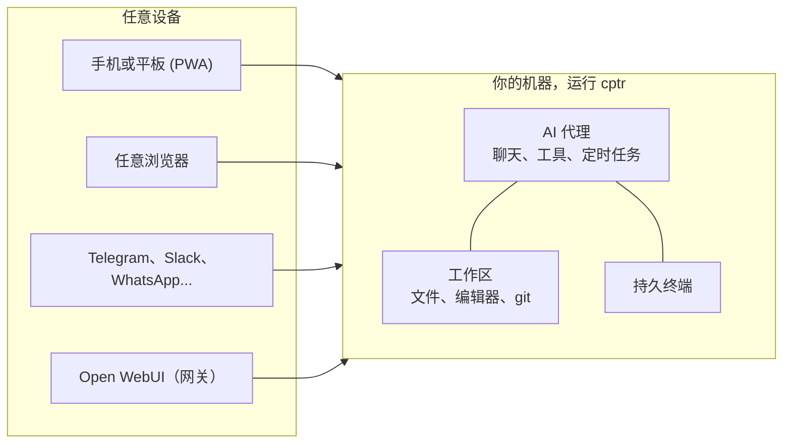

# 什么是 Computer？

你的电脑一直是一个*场所*。你走过去，坐下，工作，离开，上面的所有东西都冻结在那里，直到你回来。

Computer 改变了你电脑的本质。在上面安装一个应用，同一台机器同时变成三样新东西：

- **一个你可以从任何地方到达的地方**：你的文件、编辑器和终端呈现在网页上，在你的手机或任何浏览器中
- **一个你可以发消息的对象**：连接 Telegram 或 WhatsApp，你给你的电脑发消息，它给你回消息
- **一个你可以交付工作的对象**：添加 AI（一个 API 密钥、一个本地模型，或你已经拥有的编码代理订阅），它在你正在查看的同一文件上工作，需要你的批准

你的工作不需要移动到任何地方来实现这一切。一切都在你的机器上运行；没有什么是托管在其他地方的。

## 一台机器，一个真相

这三个面孔共享一个属性，而这就是整个产品的核心：**它们都通向同一个状态。** AI 编辑的文件就是你编辑器中的文件，也就是磁盘上的文件。你在办公桌上启动的终端就是在火车上手机中的那个终端。你在聊天中决定的事情就是项目文件夹中的一个文件，明年也能找到。没有同步，没有复制，没有"关联的账户"。一台机器，一个真相，三种进入方式。

因为一切都是你拥有的机器上的普通文件，整个系统保持可审查：聊天、技能、记忆、制品。没有任何东西被禁锢在应用中。

## 顿悟时刻

定义只能带你走到这一步。以下是人们真正理解的四个时刻。找到最近的一个，去体验它：

1. 你的终端，仍在运行，在你的手机上，在火车上：[从手机推送修复](/ecosystem/computer/use-cases/fix-from-your-phone)
2. AI 重新整理了你的文件，并对每一步移动请求了许可：[清理杂乱的文件夹](/ecosystem/computer/use-cases/clean-up-a-messy-folder)
3. 在你问之前，你自己的电脑已经给你发送了早间简报：[一个主动给你发消息的助手](/ecosystem/computer/use-cases/an-assistant-that-texts-first)
4. 你交付了整个研究工作，回来时已完成文件：[委派整个工作](/ecosystem/computer/use-cases/delegate-a-whole-job)

## 从另一个世界而来

如果你已经生活在以下某个类别中，这里是最简短诚实的桥梁：

| 来自... | 保留这个期望 | 更新这个期望 |
| --- | --- | --- |
| 远程桌面或 SSH（VNC、RDP、tmux over SSH） | 你可以从任何地方访问真实的机器 | 它是结构化的（文件、git、编辑器作为一等移动端 UI），会话在断开连接后仍然存活，AI 也可以操作机器 |
| 浏览器 IDE（Codespaces、code-server） | 浏览器标签页中的完整工作站；code-server 甚至像 Computer 一样自托管 | 手机是一等屏幕，而非缩小版的桌面 UI；内置带审批的 AI、消息机器人和定时任务，而非后期添加；而且它不仅限于代码：PDF、笔记和语音备忘录都是平等的公民 |
| 聊天助手（ChatGPT、Open WebUI） | 与有能力模型的对话 | 对话获得了双手和家园：真实文件、真实命令，聊天本身成为项目的一部分，在你的磁盘上 |
| 个人 AI 代理（OpenClaw、Hermes Agent） | 始终在线且以消息为原生界面，具备记忆、定时任务以及对文件系统和 shell 的完全访问权限，运行在你自己的硬件上 | 区别在于你所在的玻璃这一侧：在那里，代理拥有机器，你拥有聊天。Computer 也给你机器：文件浏览器、编辑器、差异和终端都在你的浏览器中，这样你可以在代理工作的同一位置观察、审查和接管。而且即使完全没有 AI，它也是一个完整的工作站 |
| 终端编码代理（Claude Code、Codex、Cursor） | 在真实仓库上的专业代理 | Computer 是它的家园，而非替代品：你现有的订阅成为具有审批和跨设备恢复能力的聊天后端，任何 CLI 仍然在终端中运行 |

## 给机器多少权限由你决定

直接在主机上运行 `cptr`，它服务于整个机器。对于个人工作站来说这就是重点：价值恰恰在于没有任何东西对你设限。

在 [Docker](/ecosystem/computer/install/docker) 中运行它，它只服务于你挂载的内容，别无其他：一个有限的工作站，只包含你选择暴露的项目。同一产品，不同的影响范围；边界是你在安装时做出的决定，而非后来发现的限制。

无论哪种方式都成立：你允许登录的每个人共享该边界内的相同访问权限。这是一个信任域，就像 SSH 一样，所以保持私有，在共享之前阅读[安全模型](/ecosystem/computer/phone-and-remote/security)。

## 它不是

- **不是云服务。** 没有任何人的账户，没有托管任何东西，没有向外界发送信息。拔掉网络，工作站仍然工作。
- **不是模型。** 它本身不提供任何 AI。带上任何提供商，本地或托管，或者不带：文件、终端和 git 在零 AI 配置下也能完全使用。
- **不是多租户。** 账户存在；但用户之间没有隔离。像共享 SSH 密钥一样共享它，也就是说：有限度地，且仅在同一个信任域内。

## 如何用一句话描述

- 对开发者："你的开发机器在浏览器标签页中，你的编码代理订阅就在其中。"
- 对自托管者："云代理委派，不过是你的硬件和你的数据。"
- 对学生："你的学校文件夹和 AI 导师在你自己的笔记本电脑上，可从手机访问。"
- 对任何人："你的电脑，随时随地，带有一个在其中工作的 AI。"
