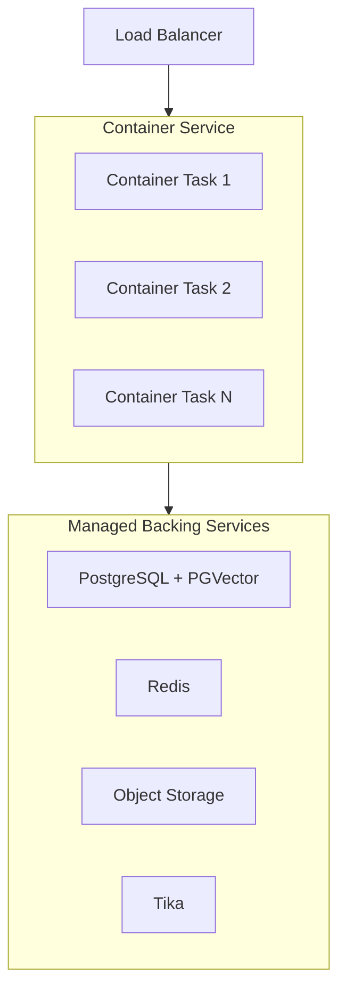

# 容器服务

在 AWS ECS/Fargate、Azure Container Apps 或 Google Cloud Run 等托管容器平台上运行官方 `ghcr.io/open-webui/open-webui` 镜像。

:::info 前置条件
继续之前，请先确认你已经配置好了[共享基础设施要求](/enterprise/deployment#shared-infrastructure-requirements)——包括 PostgreSQL、Redis、向量数据库、共享存储和内容提取服务。
:::

## 何时选择这种模式

- 你希望获得容器的优势（不可变镜像、版本化部署、无需管理操作系统），但不想引入 Kubernetes 复杂度
- 你的组织已经在使用托管容器平台
- 你需要以较低运维开销实现快速扩缩容
- 你更偏好平台原生自动扩缩容的托管基础设施

## 架构



## 镜像选择

为保证生产稳定性，请使用**版本号 tag**：

```
ghcr.io/open-webui/open-webui:v0.x.x
```

请避免在生产环境中使用 `:main` tag——它始终跟踪最新开发构建，可能在没有预警的情况下引入破坏性变更。最新稳定版本请查看 [Open WebUI 发布版本](https://github.com/open-webui/open-webui/releases)。

## 扩展策略

- **平台原生自动扩缩容**：按 CPU 利用率、内存或请求数配置扩缩容规则。
- **健康检查**：使用 `/health` 端点作为存活与就绪检查。
- **任务级环境变量**：在任务定义中通过环境变量或密钥传入所有共享基础设施配置。
- **会话亲和性**：在负载均衡器上启用粘性会话以提升 WebSocket 稳定性。虽然 Redis 负责跨实例协调，但会话亲和性可减少不必要的会话切换。

## 关键注意事项

| 注意事项 | 说明 |
| :--- | :--- |
| **存储** | 使用对象存储（S3、GCS、Azure Blob）或共享文件系统（例如 EFS）。容器本地存储是临时性的，且不会在任务间共享。 |
| **Tika Sidecar** | 可将 Tika 作为同一任务定义中的 sidecar 容器运行，或作为独立服务运行。采用 sidecar 模式可让提取流量保持本地。 |
| **密钥管理** | 对于 `DATABASE_URL`、`REDIS_URL` 和 `WEBUI_SECRET_KEY`，请使用平台提供的密钥管理器（AWS Secrets Manager、Azure Key Vault、GCP Secret Manager）。 |
| **更新** | 先以单任务方式执行滚动部署——该任务负责运行迁移（`ENABLE_DB_MIGRATIONS=true`）。确认健康后，再将其余任务扩展起来，并设置 `ENABLE_DB_MIGRATIONS=false`。 |

## 需要避免的反模式

| 反模式 | 影响 | 修复方式 |
| :--- | :--- | :--- |
| 使用本地 SQLite | 任务重启即丢数据，多任务时会出现数据库锁 | 将 `DATABASE_URL` 设置为 PostgreSQL |
| 使用默认 ChromaDB | 基于 SQLite 的向量数据库在多进程访问下容易崩溃 | 设置 `VECTOR_DB=pgvector`（或 Milvus/Qdrant） |
| `WEBUI_SECRET_KEY` 不一致 | 登录循环、401 错误、会话无法跨任务保持 | 通过密钥管理器为所有任务设置同一密钥 |
| 未配置 Redis | WebSocket 失败、配置不同步、“Model Not Found” 错误 | 设置 `REDIS_URL` 和 `WEBSOCKET_MANAGER=redis` |

容器基础部署可参考 [快速入门指南](/getting-started/quick-start)。

---

**需要帮助规划企业部署？** 我们的团队正与全球组织合作，共同设计和落地生产级 Open WebUI 环境。

[**联系企业销售 → sales@openwebui.com**](mailto:sales@openwebui.com)
