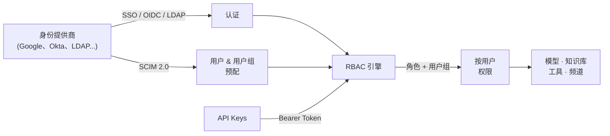

# 🔐 认证与访问控制

**控制谁可以登录、他们能做什么，以及你的实例如何与身份体系集成。**

Open WebUI 从第一天起就支持多用户。无论你是在运行个人实例还是跨组织管理数千个席位，你都可以完全控制认证、授权和程序化访问。连接你的身份提供商、定义细粒度权限、自动化用户生命周期管理——无需修改一行代码。

---

## 本节内容

| | |
| :--- | :--- |
| 👥 **[RBAC](./rbac)** | 角色、用户组和按资源设置的权限。定义谁可以访问什么 |
| 🔑 **[SSO / OIDC](./auth/sso)** | 使用 Google、Microsoft、Okta、Keycloak 或任何 OIDC 提供商进行联合认证 |
| 📂 **[LDAP](./auth/ldap)** | 对你现有的目录服务进行认证 |
| 📋 **[SCIM 2.0](./auth/scim)** | 从你的 IdP 自动化用户和用户组的预配与取消预配 |
| 🔐 **[API Keys](./api-keys)** | 用于脚本、机器人、流水线和集成的程序化访问 |

---

## 整体架构

1. **用户通过** SSO、OIDC、LDAP 或本地凭据**进行认证**。
2. **SCIM 从身份提供商自动预配**用户和用户组。
3. **RBAC 根据**角色（管理员、用户）和用户组成员资格**确定访问权限**。
4. **权限是累加的**：每个用户组成员资格都会增加能力，而不会减少。
5. **API Keys** 继承创建用户的完整权限，用于程序化访问。

:::tip 以 SSO 为中心的用户体验
在仅 SSO 的环境中，你可以通过 `ENABLE_PASSWORD_AUTH=false` 禁用本地密码认证，并通过 `ENABLE_PASSWORD_CHANGE_FORM=false` 隐藏账户页面中的密码更新控件。
:::

---

## 快速开始

### 个人或小团队？从简单开始

Open WebUI 开箱即用，支持本地邮箱/密码认证。不需要外部身份提供商。创建账户、分配管理员或用户角色，即可完成。

### 组织？分层引入 SSO 和 SCIM

1. **[设置 SSO](./auth/sso)**：配置你的身份提供商以实现单点登录
2. **[配置 RBAC](./rbac)**：创建用户组、分配权限并设置访问控制列表
3. **[启用 SCIM](./auth/scim)** *（可选）*：从你的 IdP 自动化用户生命周期
4. **[生成 API Keys](./api-keys)** *（可选）*：为自动化启用程序化访问

---

## 核心概念

### 累加权限

Open WebUI 的安全模型是**累加**的。用户从其角色的默认权限开始，用户组成员资格只会*增加*能力。用户的有效权限是其角色和所有用户组授予的所有权限的并集。

### 按资源访问控制

模型、知识库、工具和 Skills 都支持细粒度访问控制。资源**默认为私有**。创建者通过用户授权、用户组授权或公开可见性来控制谁可以查看和使用它们。

### 管理员与用户

有两种主要角色。**管理员**拥有完整的系统访问权限。**用户**的能力由默认权限加上用户组成员资格定义。第三种角色**待审批**，将新注册用户放入队列等待管理员批准。

[**角色 →**](./rbac/roles) · [**权限 →**](./rbac/permissions) · [**用户组 →**](./rbac/groups)
