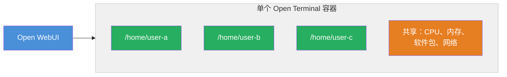
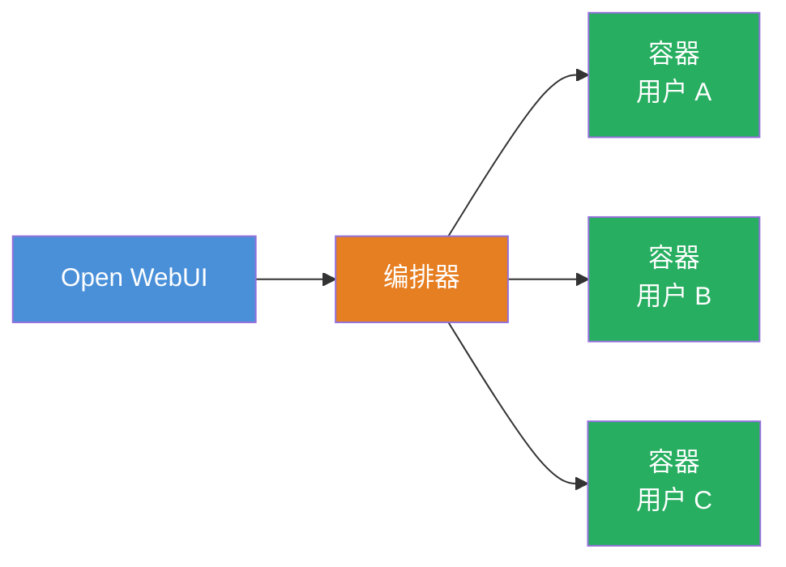

# 为团队配置 Open Terminal

当你团队中的多人需要通过 Open WebUI 访问终端时，你有两种选择。

| | 单容器 | 每用户独立容器 |
| :--- | :--- | :--- |
| **方式** | 一个容器，容器内独立账户 | 每个用户拥有自己的容器 |
| **隔离** | 文件独立，但共享同一系统 | 完全隔离——所有资源均独立 |
| **配置** | 一个额外设置 | 额外的编排服务 |
| **适用场景** | 你信任的小团队 | 生产环境、较大团队、不受信任的用户 |
| **包含于** | Open Terminal（免费） | [Terminals](https://github.com/open-webui/terminals)（企业版） |

:::danger 多用户 Open WebUI 部署必读
如果你的 Open WebUI 实例**拥有不止一个用户账户**，并且同一个 terminal-server 连接被多个用户共享，那么你**必须**使用下面两种隔离模式之一。一个未设置 `OPEN_TERMINAL_MULTI_USER=true` 的单 Open Terminal 容器（或没有通过 Terminals 提供的每用户独立容器）会把所有用户放进同一个 shell、同一份文件系统、同一个网络命名空间——这意味着任何用户都能读取、修改或替换其他用户的文件，能以共享用户身份执行命令，还能绑定共享端口。这种配置在多用户 Open WebUI 中并不受支持。

对于**包含不可信用户**的部署（开放注册、对公网门户、混合租户场景），仅靠方式 1 也不够——文件层面的隔离并不延伸到网络命名空间，因此用户依然可以通过共享容器上绑定的端口互相访问。这类部署应使用**方式 2（通过 Terminals 提供的每用户容器）**，或在方式 1 之上叠加 `TERMINAL_PROXY_HEADERS` 来限制代理响应在用户浏览器中的能力。
:::

---

## 方式 1：内置多用户模式

最简单的方式。添加一个设置，每个人会自动获得独立的工作区。

```bash
docker run -d --name open-terminal -p 8000:8000 \
  -v open-terminal:/home \
  -e OPEN_TERMINAL_MULTI_USER=true \
  -e OPEN_TERMINAL_API_KEY=your-secret-key \
  ghcr.io/open-webui/open-terminal
```

<!-- TODO: 截图——终端中的 Docker run 命令，并高亮 MULTI_USER=true 标志。 -->

### 工作原理

当有人通过 Open WebUI 使用终端时，Open Terminal 会自动：

1. 根据该用户的 Open WebUI 用户 ID 为其创建个人账户
2. 在 `/home/{user-id}` 设置私有主目录
3. 在其自己的账户下运行所有命令
4. 将其文件访问限制在自己的文件夹内

每个用户在文件浏览器中只能看到自己的文件。

<!-- TODO: 截图——并排显示两个视图：用户 A 的文件浏览器展示 /home/user-a/ 及其文件，用户 B 的文件浏览器展示 /home/user-b/ 及完全不同的文件。 -->

### 独立与共享的内容

| | 每用户独立 | 共享 |
| :--- | :--- | :--- |
| 主目录和文件 | ✔ | |
| 运行命令 | ✔ | |
| 系统软件包 | | ✔ |
| CPU 和内存 | | ✔ |
| 网络访问 | | ✔ |

:::warning 适合小团队，不适合生产环境
此模式给每个人提供独立的工作区，但所有人都运行在同一个容器内。资源压力（内存、CPU）是共享的，**网络命名空间也是共享的**——任何用户只要绑定了端口（例如 `python -m http.server 8080`），其他用户就可以通过各自的 terminal-server 代理 URL 在该端口上访问到他。每用户文件隔离在这种方式下**并不**延伸到每用户网络隔离。

此模式仅适合规模小、彼此信任的团队——不适合大规模开放部署。对于不可信的多用户部署，请使用下方的**方式 2（每用户独立容器）**，或在此基础上叠加 [`TERMINAL_PROXY_HEADERS`](/reference/env-configuration#terminal_proxy_headers) 配置，用沙盒化的 CSP 锁住代理响应。
:::



---

## 方式 2：使用 Terminals 实现每用户独立容器

对于较大规模部署或需要真正隔离的场景，[**Terminals**](../terminals/) 为每个用户提供完全独立于其他人的容器。

- **完全隔离** — 每个用户的容器独立运行，拥有各自的文件、进程和资源
- **按需分配** — 容器在用户启动会话时创建，空闲时自动清理
- **资源控制** — 可按用户或按环境设置 CPU、内存和存储限制
- **多环境支持** — 为不同团队提供不同配置（如数据科学、开发等）
- **Kubernetes 支持** — 支持 Docker、Kubernetes 和 k3s



提供两种部署后端：

- **[Docker 后端](../terminals/)** — 运行在单个 Docker 宿主机上。适合中小型团队或没有 Kubernetes 的环境。
- **[Kubernetes Operator](../terminals/)** — 使用基于 CRD 的 Operator 进行生产级部署，通过 Helm chart 与 Open WebUI 一起部署。

:::info 需要企业许可证
Terminals 需要 [Open WebUI 企业许可证](https://openwebui.com/enterprise)。许可证详情请参阅 [Terminals 仓库](https://github.com/open-webui/terminals)。
:::

## 相关链接

- [Terminals 概述 →](../terminals/)
- [Terminals：Docker 后端 →](../terminals/)
- [Terminals：Kubernetes Operator →](../terminals/)
- [安全最佳实践 →](./security)
- [所有配置选项 →](./configuration)
