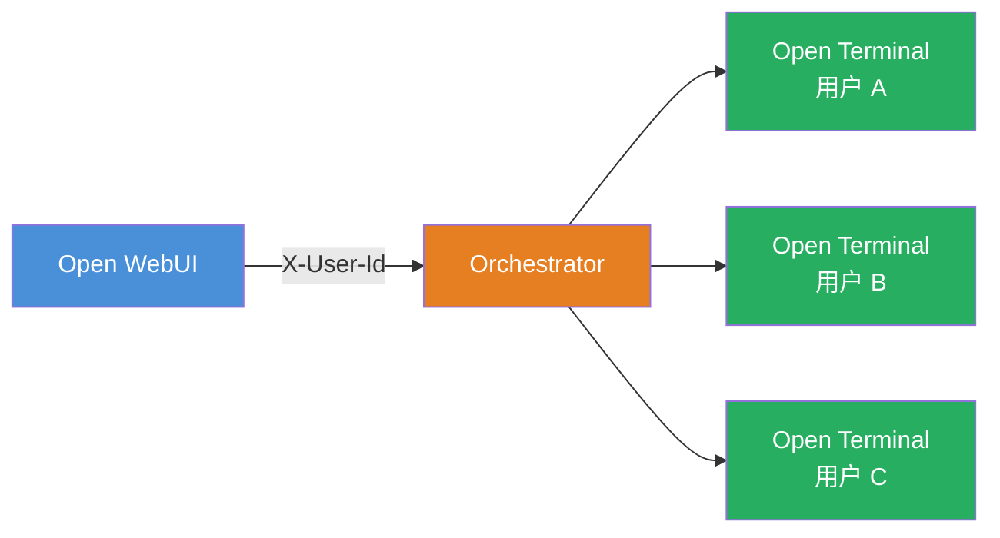

import Tabs from '@theme/Tabs';
import TabItem from '@theme/TabItem';

import Docker from './tab-deployment/Docker.md';
import Kubernetes from './tab-deployment/Kubernetes.md';

# Terminals（编排器）

**Terminals** 是 [Open Terminal](/features/open-terminal) 的企业级编排层，为每位用户提供完全隔离的终端容器。不再共享单一容器，每个人都有自己专属的容器，包括独立的文件、进程、资源限制和网络隔离。

:::tip 快速导航
- **需要操作用户终端环境？** → [编排指南](/features/open-terminal/terminals/orchestration)
:::

:::info Admin UI（0.0.4 新增）
编排器在 `/` 提供内置的最小化管理 UI，用于查看终端状态、活动会话和策略。默认启用，可通过 `TERMINALS_ENABLE_UI` 切换；设为 `false` 可仅用于 API 部署。
:::

---

## 工作原理

编排器位于 Open WebUI 和 Open Terminal 实例之间：

1. 用户在 Open WebUI 中激活一个终端。
2. Open WebUI 将请求代理到**编排器**——一个管理终端容器生命周期的服务。
3. 编排器为该用户分配专属的 Open Terminal 容器（或重新连接到已有容器）。
4. 所有流量均通过编排器代理。用户永远不会直接连接到自己的容器。
5. 空闲容器在可配置的超时时间后自动清理。数据可选择性地在会话间持久化。

编排器还暴露与 Open Terminal 相同的基于 OpenAPI 的工具接口，因此 AI 可以执行命令、读取文件和运行代码，所有操作都限定在发起请求的用户容器范围内。

---

## 部署

<Tabs>
  <TabItem value="docker" label="Docker" default>
    

      <Docker />
    

  </TabItem>
  <TabItem value="kubernetes" label="Kubernetes Operator">
    

      <Kubernetes />
    

  </TabItem>
</Tabs>

---

## 认证

编排器支持三种认证模式：

| 模式 | 适用场景 | 配置方式 |
| :--- | :--- | :--- |
| **Open WebUI JWT** | 生产环境。编排器验证 Open WebUI 实例的 token。 | 在编排器上将 `TERMINALS_OPEN_WEBUI_URL` 设置为你的 Open WebUI URL。 |
| **共享 API Key** | 标准方式。Open WebUI 在每个请求中携带共享密钥。 | 在 Open WebUI 和编排器上将 `TERMINALS_API_KEY` 设置为相同的值。 |
| **开放模式** | 仅用于开发。无认证，不可在生产中使用。 | 将 `TERMINALS_OPEN_WEBUI_URL` 和 `TERMINALS_API_KEY` 都留空。 |

通过 Docker Compose 或 Helm 部署时，Open WebUI 和编排器之间的共享 API Key 会自动配置。

---

## 故障排除

### 终端无法启动

1. **检查编排器日志。** 编排器会记录完整的分配流程，包括镜像拉取和容器创建。查找与镜像可用性或资源限制相关的错误。
2. **验证 API Key。** 确保 `TERMINALS_API_KEY` 在 Open WebUI 和编排器之间一致。不匹配会导致静默认证失败。
3. **检查镜像拉取权限。** 如果使用私有容器镜像仓库，请确保编排器（Docker）或集群（Kubernetes）已配置拉取凭据。

### 认证失败

- 使用 **JWT 模式**时，确认 `TERMINALS_OPEN_WEBUI_URL` 指向可访问的 Open WebUI 实例。
- 使用 **API Key 模式**时，确认两端的密钥完全一致。检查是否有多余的空格或换行。
- 查看编排器日志中的 `401` 或 `403` 响应。

### 容器被过快清理

增大 `TERMINALS_IDLE_TIMEOUT_MINUTES`（或策略中的 `idle_timeout_minutes`）。默认值为 `0`（禁用），但如果设置过低，容器可能在用户还在工作时就被清理掉。`30` 是一个典型值。

### 连接被拒绝

- **Docker：** 确保设置了 `TERMINALS_NETWORK`，使容器可以通过名称互相通信。若未设置，容器使用已发布的端口，且 `TERMINALS_DOCKER_HOST` 地址必须可访问。
- **Kubernetes：** 验证编排器 Service 是否可从 Open WebUI Pod 访问。运行 `kubectl get svc -n open-webui` 确认服务存在。

---

## 延伸阅读

- [多用户配置](../advanced/multi-user)：隔离方式对比
- [安全最佳实践](../advanced/security)
- [配置参考](../advanced/configuration)：所有 Open Terminal 容器设置

---

## 许可证

Terminals 在生产环境中使用需要 [Open WebUI 企业许可证](https://openwebui.com/enterprise)。详情请参阅 [Terminals 仓库](https://github.com/open-webui/terminals)。
