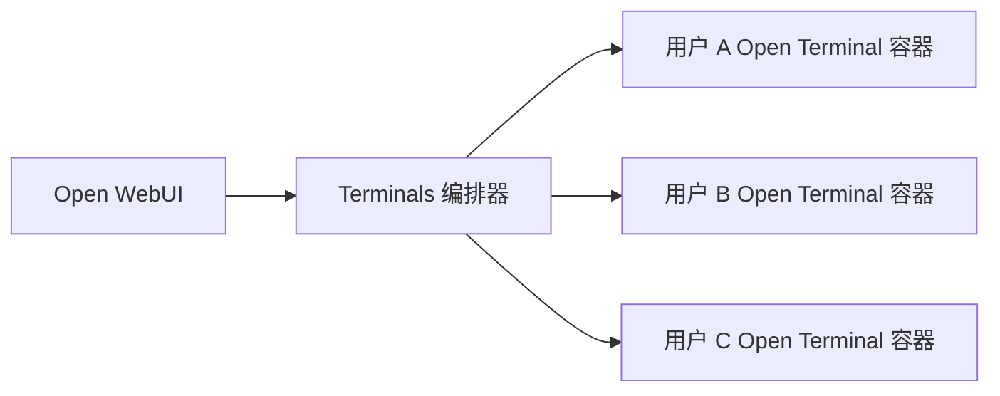

# 编排

Terminals 编排器为每个 Open WebUI 用户提供一个专用的 Open Terminal 容器。Open WebUI 存储连接信息，编排器解析策略，Open Terminal 在每个用户容器中运行。

当用户打开终端时，Open WebUI 通过 `/p/{policy_id}/...` 路由。编排器为该用户在选定策略下预配或复用其容器。

## 阅读本节

- [策略](/features/open-terminal/terminals/orchestration/policies)：镜像选择、资源、存储、环境变量和空闲超时。
- [环境变量](/features/open-terminal/terminals/orchestration/environment-variables)：原始环境值、引号处理、转发行为和保留键。
- [应用变更](/features/open-terminal/terminals/orchestration/applying-changes)：为什么变更只影响新预配的终端以及如何刷新用户。
- [自定义镜像](/features/open-terminal/terminals/orchestration/custom-images)：构建、标记、推送、配置和发布自定义 Open Terminal 镜像。
- [定时重置](/features/open-terminal/terminals/orchestration/scheduled-resets)：定期重置计划、空闲安全重置行为以及哪些内容会被删除。
- [OpenShift](/features/open-terminal/terminals/orchestration/openshift)：OpenShift 上受限的每用户终端沙箱。
- [系统提示词](/features/open-terminal/terminals/orchestration/system-prompts)：生成的提示词、`OPEN_TERMINAL_SYSTEM_PROMPT`、占位符和 `OPEN_TERMINAL_INFO`。
- [文件浏览器根目录](/features/open-terminal/terminals/orchestration/file-browser-home-boundary)：Open Terminal 如何为客户端暴露可视根目录以渲染和限制导航。
- [API 和故障排除](/features/open-terminal/terminals/orchestration/api-troubleshooting)：策略 API、刷新 API 和精确支持答案。

## 职责划分

| 层 | 职责 |
| :--- | :--- |
| Open WebUI | 存储编排器连接信息、选择策略、呈现终端和文件浏览器 UI |
| Terminals 编排器 | 认证请求、解析策略、预配容器、转发环境变量、应用空闲超时、处理刷新/生命周期工作 |
| 策略 | 定义镜像、环境、资源、存储和空闲超时 |
| 策略生命周期 | 定义随时间推移的维护行为，例如终端持久化文件的定时重置 |
| Open Terminal 容器 | 执行命令、提供文件服务、暴露 OpenAPI 工具、报告文件浏览器根元数据 |

## 编排器环境变量

这些配置编排器服务本身，以 `TERMINALS_` 为前缀（或在 `.env` 文件中设置）。它们与[环境变量](/features/open-terminal/terminals/orchestration/environment-variables)中介绍的每容器 `OPEN_TERMINAL_*` 策略变量不同，后者会被转发到每个用户的容器中。

| 变量 | 默认值 | 描述 |
| :--- | :--- | :--- |
| `TERMINALS_BACKEND` | `docker` | 使用的后端：`docker`、`kubernetes` 或 `kubernetes-operator` |
| `TERMINALS_API_KEY` | *（未设置）* | API 认证的 Bearer 令牌。未设置表示无认证（仅开发环境） |
| `TERMINALS_OPEN_WEBUI_URL` | *（未设置）* | 如果设置，则针对此 Open WebUI 实例验证 JWT |
| `TERMINALS_HOST` | `0.0.0.0` | 编排器 HTTP 服务器绑定的地址 |
| `TERMINALS_PORT` | `3000` | 编排器 HTTP 服务器监听的端口 |
| `TERMINALS_ENABLE_UI` | `true` | 在 `/` 提供内置的最小化管理 UI。API-only 部署设置为 `false` |
| `TERMINALS_LOG_LEVEL` | `INFO` | 最低日志级别：`DEBUG`、`INFO`、`WARNING`、`ERROR` 或 `CRITICAL` |
| `TERMINALS_DATABASE_URL` | `sqlite+aiosqlite:///<data>/terminals.db` | SQLAlchemy 数据库 URL。默认为 SQLite；PostgreSQL 可选 |
| `TERMINALS_IMAGE` | `ghcr.io/open-webui/open-terminal:latest` | 策略未设置时的默认容器镜像 |
| `TERMINALS_NETWORK` | *（未设置）* | 终端容器的 Docker 网络。设置后，容器通过名称而非发布端口访问 |
| `TERMINALS_DOCKER_HOST` | `127.0.0.1` | 用于访问已发布容器端口的地址（Docker 后端） |
| `TERMINALS_DATA_DIR` | `<data>/terminals` | 存放每用户持久化文件的主机目录（Docker 后端） |
| `TERMINALS_IDLE_TIMEOUT_MINUTES` | `0` | 在 N 分钟不活动后关闭终端（`0` = 禁用） |
| `TERMINALS_MAX_CPU` | *（未设置）* | 策略不能超过的每容器 CPU 硬上限 |
| `TERMINALS_MAX_MEMORY` | *（未设置）* | 策略不能超过的每容器内存硬上限 |
| `TERMINALS_MAX_STORAGE` | *（未设置）* | 策略不能超过的每容器存储硬上限 |
| `TERMINALS_ALLOWED_IMAGES` | *（未设置）* | 逗号分隔的允许镜像模式列表（glob）。空值允许任何镜像 |
| `TERMINALS_KUBERNETES_NAMESPACE` | `terminals` | 终端 Pod 的命名空间（Kubernetes 后端） |
| `TERMINALS_KUBERNETES_IMAGE` | `ghcr.io/open-webui/open-terminal:latest` | 终端 Pod 的默认镜像（Kubernetes 后端） |
| `TERMINALS_KUBERNETES_STORAGE_CLASS` | *（未设置）* | PVC 的 StorageClass。空值使用集群默认值 |
| `TERMINALS_KUBERNETES_STORAGE_SIZE` | `1Gi` | 策略未设置时的默认 PVC 大小 |
| `TERMINALS_KUBERNETES_STORAGE_MODE` | `per-user` | 存储模式：`per-user`、`shared` 或 `shared-rwo` |
| `TERMINALS_KUBERNETES_SERVICE_TYPE` | `ClusterIP` | 终端 Pod 的服务类型 |
| `TERMINALS_KUBERNETES_KUBECONFIG` | *（未设置）* | kubeconfig 的路径。空值使用集群内配置 |
| `TERMINALS_KUBERNETES_LABELS` | *（未设置）* | 以 `k=v,k2=v2` 格式应用于创建资源的额外标签 |
| `TERMINALS_KUBERNETES_RESTRICTED` | `false` | 全局启用受限的 Kubernetes/OpenShift Pod 默认值 |
| `TERMINALS_KUBERNETES_POD_SECURITY_CONTEXT` | `{}` | JSON Pod 安全上下文，合并到终端 Pod 中 |
| `TERMINALS_KUBERNETES_CONTAINER_SECURITY_CONTEXT` | `{}` | JSON 容器安全上下文，合并到终端容器中 |
| `TERMINALS_KUBERNETES_CRD_GROUP` | `openwebui.com` | 操作员后端监控的 CRD 组 |
| `TERMINALS_KUBERNETES_CRD_VERSION` | `v1alpha1` | 操作员后端监控的 CRD 版本 |

任何此处省略的值都回退到显示的默认值。请参阅 [`config.py`](https://github.com/open-webui/terminals/blob/main/terminals/config.py) 获取权威列表。

## 重要行为

策略变更适用于新预配的终端。正在运行的现有终端保留其当前镜像和环境，直到它们被停止、刷新或被空闲超时清理。

可视文件浏览器边界用于可用性。Open Terminal 报告一个客户端可以渲染为 `Home` 的根路径，并用于隐藏父文件夹，但它不是安全边界。
