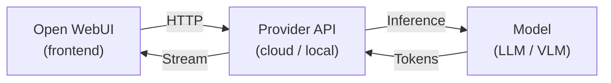

# 🔌 连接提供商

**把 Open WebUI 连接到你的模型提供商，几分钟内开始聊天。**

Open WebUI 支持多种连接协议，包括 **Ollama**、**兼容 OpenAI 的 API** 与 **Open Responses**。任何实现这些协议的云端 API 或本地服务都可以开箱即用。你只需填写 URL 和 API 密钥，模型就会出现在下拉列表中。

---

## 工作原理

1. **你在 Open WebUI 中输入消息**
2. Open WebUI 将消息发送到你的提供商 API 端点
3. 提供商在所选模型上执行推理
4. token **实时流式返回**到 Open WebUI
5. 你在聊天界面中看到回复

:::tip
添加提供商通常只需要在 **管理面板 → 连接** 中填写 URL 和 API 密钥。对于大多数提供商，Open WebUI 都能自动发现可用模型。
:::

---

## 云端提供商

托管 API，需要账户和 API 密钥。无需本地硬件。

| 提供商 | 模型 | 指南 |
|----------|--------|-------|
| **Ollama** | Llama、Mistral、Gemma、Phi 等数千种模型（本地） | [从 Ollama 开始 →](./starting-with-ollama) |
| **OpenAI** | GPT-4o、GPT-4.1、o3、o4-mini | [从 OpenAI 开始 →](./starting-with-openai) |
| **Anthropic** | Claude Opus、Sonnet、Haiku | [从 Anthropic 开始 →](./starting-with-anthropic) |
| **兼容 OpenAI** | Google Gemini、DeepSeek、Mistral、Groq、OpenRouter、Vercel AI Gateway、Amazon Bedrock、Azure 等 | [兼容 OpenAI 的提供商 →](./starting-with-openai-compatible) |

---

## 本地服务器

在你自己的硬件上运行模型。无需 API 密钥，也不依赖云服务。

| 服务器 | 说明 | 指南 |
|--------|-------------|-------|
| **llama.cpp** | 使用兼容 OpenAI 的 API 高效运行 GGUF 模型推理 | [从 llama.cpp 开始 →](./starting-with-llama-cpp) |
| **vLLM** | 面向生产负载的高吞吐推理引擎 | [从 vLLM 开始 →](./starting-with-vllm) |

更多本地服务器（LM Studio、LocalAI、Docker Model Runner、Lemonade）可参见[兼容 OpenAI 的提供商](./starting-with-openai-compatible#local-servers)指南。

---

## 其他连接方式

| 功能 | 说明 | 指南 |
|---------|-------------|-------|
| **Open Responses** | 通过 Open Responses 规范连接提供商 | [从 Open Responses 开始 →](./starting-with-open-responses) |
| **Functions** | 通过自定义 pipe functions 将任意后端接入 Open WebUI | [从 Functions 开始 →](./starting-with-functions) |

---

## 在找 Agent？

如果你想连接的是具备终端访问、文件操作、网页搜索等能力的自主 AI Agent，而不是普通模型提供商，请参见 [**连接 Agent**](/getting-started/quick-start/connect-an-agent)。
