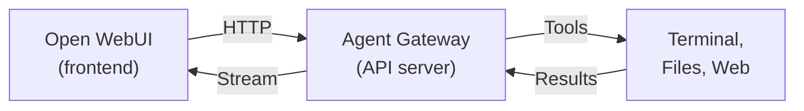

# 🤖 连接 Agent

**将 Open WebUI 作为自主 AI Agent 的聊天前端。**

AI Agent 不只是普通模型提供商。它们可以执行终端命令、读写文件、搜索网页、维护记忆，并串联复杂工作流。由于许多 Agent 框架都提供**兼容 OpenAI 的 API**，因此 Open WebUI 可以在极低配置成本下，成为它们精致且功能完整的聊天前端。

---

## 它与“提供商”有什么不同？

当你[连接提供商](/getting-started/quick-start/connect-a-provider/starting-with-openai-compatible)时，你连接的是一个**模型**。它接收你的消息并返回回复，仅此而已。

而当你连接的是 **Agent**，你接入的是一个自主系统，它可以：

- 🖥️ **在你的机器上执行终端命令**
- 📁 **在工作区中读写文件**
- 🔍 **搜索网页**获取实时信息
- 🧠 **跨对话维护记忆**
- 🧩 **使用技能和插件**扩展能力
- 🔗 **串联多个工具调用**解决复杂任务

Agent 会根据你的消息决定何时、如何使用这些工具，而 Open WebUI 会把结果呈现在熟悉的聊天界面中。

---

## 可用 Agent

| Agent | 描述 | 指南 |
|-------|-------------|-------|
| **cptr** (Open WebUI Computer) | 由 Open WebUI 团队开发，把你的电脑装进浏览器标签页；每个工作区都通过兼容 OpenAI 的网关以模型的形式接入 Open WebUI，享有完整工具访问能力 | [设置 cptr →](./cptr) |
| **Hermes Agent** | Nous Research 的自主 Agent，支持终端、文件操作、网页搜索、记忆和可扩展技能 | [设置 Hermes Agent →](./hermes-agent) |
| **OpenClaw** | 开源自托管 Agent 框架，支持 shell 访问、文件操作、网页浏览和消息频道集成 | [设置 OpenClaw →](./openclaw) |

---

## 工作原理

无论你连接的是哪个 Agent，整体架构都一样：

1. **你在 Open WebUI 中输入消息**
2. Open WebUI 将消息发送给 Agent 的 API 服务器（就像它会发给 OpenAI 一样）
3. Agent **决定使用哪些工具**、执行它们，并根据结果继续推理
4. 最终回复**流式返回**到 Open WebUI，并可带上进度提示
5. 你在熟悉的聊天界面中看到结果，同时保留完整会话历史、用户体系以及 Open WebUI 的全部功能

:::tip
由于多数 Agent 都实现了标准 OpenAI 聊天补全协议，因此添加一个 Agent 往往只需在 **管理面板 → 连接 → OpenAI** 中填入 URL 和 API 密钥。无需插件、无需 pipes、无需中间层。
:::
