<!-- markdownlint-disable MD060 -->

<a id="database-encryption-with-sqlcipher"></a>

:::warning

本教程是社区贡献，不受 Open WebUI 团队支持。它仅作为如何针对特定用例定制 Open WebUI 的演示。想做出贡献？请查看贡献教程。

:::

> [!WARNING]
> 本文档反映了截至 Open WebUI v0.10.0 的 schema 更改。

## Open-WebUI 内部 SQLite 数据库

对于 Open-WebUI，SQLite 数据库充当用户管理、聊天历史、文件存储和各种其他核心功能的骨干。了解此结构对于任何希望有效地做出贡献或维护该项目的人来说都是必不可少的。

## 内部 SQLite 位置

你可以在 `root` -> `data` -> `webui.db` 找到 SQLite 数据库

```txt
📁 Root (/)
├── 📁 data
│   ├── 📁 cache
│   ├── 📁 uploads
│   ├── 📁 vector_db
│   └── 📄 webui.db
├── 📄 dev.sh
├── 📁 open_webui
├── 📄 requirements.txt
├── 📄 start.sh
└── 📄 start_windows.bat
```

## 本地复制数据库

如果你想将容器中运行的 Open-WebUI SQLite 数据库复制到本地机器，可以使用：

```bash
docker cp open-webui:/app/backend/data/webui.db ./webui.db
```

或者，你可以使用以下命令在容器内访问数据库：

```bash
docker exec -it open-webui /bin/sh
```

## 表概览

以下是 Open-WebUI SQLite 数据库中所有表的完整列表。为方便起见，各表按字母顺序排列并编号。

| **编号** | **表名**   | **描述**                                              |
| ------- | ---------------- | ------------------------------------------------------------ |
| 01      | access_grant     | 存储所有资源的标准化访问控制授权                            |
| 02      | auth             | 存储用户认证凭据和登录信息                                  |
| 03      | calendar         | 存储用户拥有的带访问控制的日历                              |
| 04      | calendar_event   | 存储支持重复 (RRULE) 的日历事件                             |
| 05      | calendar_event_attendee | 跟踪共享日历事件的参与者 RSVP 状态                          |
| 06      | channel          | 管理聊天频道及其配置                                        |
| 07      | channel_file     | 将文件链接到频道和消息                                      |
| 08      | channel_member   | 跟踪频道内的用户成员资格和权限                              |
| 09      | chat             | 存储聊天会话及其元数据                                      |
| 10      | chat_file        | 将文件链接到聊天和消息                                      |
| 11      | chatidtag        | 映射聊天与其关联标签之间的关系                              |
| 12      | config           | 维护系统范围的配置设置                                      |
| 13      | document         | 存储文档及其元数据以进行知识管理                            |
| 14      | feedback         | 捕获用户反馈和评分                                          |
| 15      | file             | 管理上传的文件及其元数据                                    |
| 16      | folder           | 将文件和内容组织成分层结构                                  |
| 17      | function         | 存储自定义 Function 及其配置                                |
| 18      | group            | 管理用户组及其权限                                          |
| 19      | group_member     | 跟踪组内的用户成员资格                                      |
| 20      | knowledge        | 存储知识库条目及相关信息                                    |
| 21      | knowledge_file   | 将文件链接到知识库                                          |
| 22      | memory           | 维护聊天历史和上下文记忆                                    |
| 23      | message          | 存储单个聊天消息及其内容                                    |
| 24      | message_reaction | 记录用户对消息的反应（表情/响应）                           |
| 25      | migrate_history  | 跟踪数据库 schema 版本和迁移记录                            |
| 26      | model            | 管理 AI 模型配置和设置                                      |
| 27      | note             | 存储用户创建的笔记和注释                                    |
| 28      | oauth_session    | 管理用户的活动 OAuth 会话                                   |
| 29      | prompt           | 存储 AI 提示词的模板和配置                                  |
| 30      | prompt_history   | 跟踪提示词的版本历史和快照                                  |
| 31      | shared_chat      | 存储共享聊天的快照以便链接共享                              |
| 32      | skill            | 存储可重用的 Markdown 指令集 (Skills)                       |
| 33      | tag              | 管理内容分类的标签                                          |
| 34      | tool             | 存储系统工具和集成的配置                                    |
| 35      | user             | 维护用户资料和账户信息                                      |
| 36      | automation       | 存储用户定义的计划自动化                                    |
| 37      | automation_run   | 存储自动化运行的执行历史                                    |
| 38      | pinned_note      | 跟踪每个用户的笔记置顶（每行 = 一个用户置顶一个笔记）        |
| 39      | chat_message     | 聊天会话的标准化逐条消息存储                                  |

注意：Open-WebUI 的 SQLite 数据库中有两个额外表与 Open-WebUI 的核心功能无关，已被排除在外：

- Alembic 版本表 (Alembic Version table)
- 迁移历史表 (Migrate History table)

现在我们有了所有的表，让我们了解每个表的结构。

## Access Grant 表

| **列名** | **数据类型** | **约束**         | **描述**                                        |
| --------------- | ------------- | ----------------------- | ------------------------------------------------------ |
| id              | Integer       | PRIMARY KEY, AUTOINCREMENT | 唯一标识符                                   |
| resource_type   | Text          | NOT NULL                | 资源类型（例如：`model`, `knowledge`, `tool`）  |
| resource_id     | Text          | NOT NULL                | 特定资源的 ID                            |
| principal_type  | Text          | NOT NULL                | 授权对象类型：`user` 或 `group`                     |
| principal_id    | Text          | NOT NULL                | 用户或组的 ID（或使用 `*` 表示公开）            |
| permission      | Text          | NOT NULL                | 权限级别：`read` 或 `write`                    |
| created_at      | BigInteger    | nullable                | 授权创建时间戳                               |

关于 access_grant 表的注意事项：

- 在 (`resource_type`, `resource_id`, `principal_type`, `principal_id`, `permission`) 上的唯一约束以防止重复授权
- 在 (`resource_type`, `resource_id`) 和 (`principal_type`, `principal_id`) 上建立索引以提高查询效率
- 替换了以前嵌入在每个资源表中的 `access_control` JSON 列
- `principal_type` 为 `user` 且 `principal_id` 为 `*` 表示公共（开放）访问权限
- 支持组级别和个人用户级别的访问授权

## Auth 表

| **列名** | **数据类型** | **约束** | **描述**   |
| --------------- | ------------- | --------------- | ----------------- |
| id              | String        | PRIMARY KEY     | 唯一标识符 |
| email           | String        | -               | 用户邮箱      |
| password        | Text          | -               | 哈希密码   |
| active          | Boolean       | -               | 账户状态    |

关于 auth 表的注意事项：

- 使用 UUID 作为主键
- 与 `users` 表一对一关系（共享 id）

## Channel 表

| **Column Name** | **Data Type** | **Constraints** | **Description**                     |
| --------------- | ------------- | --------------- | ----------------------------------- |
| id              | Text          | PRIMARY KEY     | 唯一标识符 (UUID)            |
| user_id         | Text          | -               | 频道的拥有者/创建者            |
| type            | Text          | nullable        | 频道类型                        |
| name            | Text          | -               | 频道名称                        |
| description     | Text          | nullable        | 频道描述                 |
| data            | JSON          | nullable        | 灵活的数据存储               |
| meta            | JSON          | nullable        | 频道元数据                    |

| created_at      | BigInteger    | -               | 创建时间戳（纳秒）    |
| updated_at      | BigInteger    | -               | 最后更新时间戳（纳秒） |

关于 auth 表的注意事项：

- 使用 UUID 作为主键
- 频道名称不区分大小写（以小写存储）

## Channel Member 表

| **Column Name** | **Data Type** | **Constraints** | **Description**                              |
| --------------- | ------------- | --------------- | -------------------------------------------- |
| id              | TEXT          | NOT NULL        | 频道成员资格的唯一标识符 |
| channel_id      | TEXT          | NOT NULL        | 对频道的引用                     |
| user_id         | TEXT          | NOT NULL        | 对用户的引用                        |
| created_at      | BIGINT        | -               | 创建成员资格的时间戳        |

## Channel File 表

| **列名** | **数据类型** | **约束**                    | **描述**                   |
| --------------- | ------------- | ---------------------------------- | --------------------------------- |
| id              | Text          | PRIMARY KEY                        | Unique identifier (UUID)          |
| user_id         | Text          | NOT NULL                           | 关系的拥有者         |
| channel_id      | Text          | FOREIGN KEY(channel.id), NOT NULL  | 对频道的引用          |
| file_id         | Text          | FOREIGN KEY(file.id), NOT NULL     | 对文件的引用             |
| message_id      | Text          | FOREIGN KEY(message.id), nullable  | 对关联消息的引用   |
| created_at      | BigInteger    | NOT NULL                           | 创建时间戳                |
| updated_at      | BigInteger    | NOT NULL                           | 最后更新时间戳             |

关于 channel_file 表的注意事项：

- 在 (`channel_id`, `file_id`) 上的唯一约束以防止重复条目
- 带有 CASCADE 删除的外键关系
- 在 `channel_id`, `file_id` 和 `user_id` 上建立索引以提高性能

## Chat 表

| **Column Name** | **Data Type** | **Constraints**         | **Description**          |
| --------------- | ------------- | ----------------------- | ------------------------ |
| id              | String        | PRIMARY KEY             | Unique identifier (UUID) |
| user_id         | String        | -                       | 聊天的拥有者        |
| title           | Text          | -                       | 聊天标题               |
| chat            | JSON          | -                       | 聊天内容和历史 |
| created_at      | BigInteger    | -                       | Creation timestamp       |
| updated_at      | BigInteger    | -                       | Last update timestamp    |
| share_id        | Text          | UNIQUE, nullable        | 共享标识符       |
| archived        | Boolean       | default=False           | 归档状态           |
| pinned          | Boolean       | default=False, nullable | 置顶状态               |
| meta            | JSON          | server_default="{}"     | 包含标签的元数据  |
| folder_id       | Text          | nullable                | 父文件夹 ID         |
| tasks           | JSON          | nullable                | 代理工作流使用的聊天级任务/待办事项列表 |
| summary         | Text          | nullable                | 可选的聊天摘要文本 |
| last_read_at    | BigInteger    | nullable                | 用于未读指示器的最后阅读时间戳 |

关于 chat 表的注意事项：

- `tasks` 和 `summary` 支持聊天会话中的结构化计划/状态 UX。
- `last_read_at` 由侧边栏未读状态逻辑使用（与 `updated_at` 比较）。
- 当聊天具有活动的分享链接时，`share_id` 引用 `shared_chat.id` 令牌。

## Shared Chat 表

| **列名** | **数据类型** | **约束**                  | **描述**                    |
| --------------- | ------------- | -------------------------------- | ---------------------------------- |
| id              | Text          | PRIMARY KEY                      | 用于 `/s/{id}` URL 的分享令牌 (UUID) |
| chat_id         | Text          | FOREIGN KEY(chat.id) CASCADE, NOT NULL | 对原始聊天的引用 |
| user_id         | Text          | NOT NULL                         | 创建分享的用户         |
| title           | Text          | nullable                         | 分享时的聊天标题      |
| chat            | JSON          | nullable                         | 分享时的聊天内容快照 |
| created_at      | BigInteger    | nullable                         | 分享创建时间戳           |
| updated_at      | BigInteger    | nullable                         | 最后重新快照时间戳         |

关于 shared_chat 表的注意事项：

- 替换了以前将共享聊天快照作为幽灵行存储在 `chat` 表中（`user_id` 设置为 `shared-{chat_id}`）的模式。
- 每行都是原始聊天在共享（或最后一次重新共享）时不可变的快照。当用户点击“更新并复制链接”时会更新此快照。
- 删除原始聊天会级联删除共享快照。
- 共享聊天的访问控制通过 `access_grant` 表（`resource_type = 'shared_chat'`）进行管理。

## Automation 表

| **Column Name** | **Data Type** | **Constraints**         | **Description** |
| --------------- | ------------- | ----------------------- | --------------- |
| id              | Text          | PRIMARY KEY             | Unique identifier (UUID) |
| user_id         | Text          | NOT NULL                | Owner of the automation |
| name            | Text          | NOT NULL                | 自动化的显示名称 |
| data            | JSON          | NOT NULL                | 自动化有效负载 (`prompt`, `model_id`, `rrule`, 可选终端配置) |
| meta            | JSON          | nullable                | 可选元数据 |
| is_active       | Boolean       | NOT NULL, default=True  | 激活/暂停状态 |
| last_run_at     | BigInteger    | nullable                | 上次执行时间 |
| next_run_at     | BigInteger    | nullable                | 下一次计划执行时间 |
| created_at      | BigInteger    | NOT NULL                | Creation timestamp |
| updated_at      | BigInteger    | NOT NULL                | Last update timestamp |

关于 automation 表的注意事项：

- `next_run_at` 已建立索引以便进行高效的到期运行轮询。
- `data.rrule` 定义了重复发生频率并驱动调度器计算。

## Automation Run 表

| **Column Name** | **Data Type** | **Constraints** | **Description** |
| --------------- | ------------- | --------------- | --------------- |
| id              | Text          | PRIMARY KEY     | Unique identifier (UUID) |
| automation_id   | Text          | NOT NULL        | 对自动化的引用 |
| chat_id         | Text          | nullable        | 此次运行创建的聊天（如果可用） |
| status          | Text          | NOT NULL        | 运行状态 (`success` / `error`) |
| error           | Text          | nullable        | 当状态为 `error` 时的错误详情 |
| created_at      | BigInteger    | NOT NULL        | 执行记录时间戳 |

关于 automation_run 表的注意事项：

- 在 `automation_id` 上建立索引以快速查询每个自动化的运行历史。
- 删除自动化时删除关联行。

## Calendar 表

| **Column Name** | **Data Type** | **Constraints**         | **Description**                    |
| --------------- | ------------- | ----------------------- | ---------------------------------- |
| id              | Text          | PRIMARY KEY             | Unique identifier (UUID)           |
| user_id         | Text          | NOT NULL                | Owner of the calendar              |
| name            | Text          | NOT NULL                | 日历显示名称              |
| color           | Text          | nullable                | 显示颜色（十六进制，例如 `#3b82f6`） |
| is_default      | Boolean       | NOT NULL, default=False | 这是否是用户的默认日历 |
| data            | JSON          | nullable                | 可扩展的数据有效负载            |
| meta            | JSON          | nullable                | Optional metadata                  |
| created_at      | BigInteger    | NOT NULL                | Creation timestamp                 |
| updated_at      | BigInteger    | NOT NULL                | Last update timestamp              |

关于 calendar 表的注意事项：

- 在 `user_id` 上建立索引以高效列出每个用户的日历。
- 在首次访问时自动创建一个默认的“Personal”（个人）日历。
- “Scheduled Tasks”（计划任务）日历是**虚拟的** — 它不存储在此表中。相反，对于具有自动化访问权限的用户，API 在响应时（使用恒定 ID `__scheduled_tasks__`）综合出它。自动化 RRULE 的未来运行和过去的执行记录都会作为该日历上的虚拟事件呈现。
- 访问控制通过 `access_grant` 表（`resource_type = 'calendar'`）进行管理，从而实现用户和组之间的日历共享。
- 用户只能删除非默认日历。删除日历会级联到其所有事件、参与者和访问授权。

## Calendar Event 表

| **Column Name** | **Data Type** | **Constraints**         | **Description**                    |
| --------------- | ------------- | ----------------------- | ---------------------------------- |
| id              | Text          | PRIMARY KEY             | Unique identifier (UUID)           |
| calendar_id     | Text          | NOT NULL                | 对父日历的引用       |
| user_id         | Text          | NOT NULL                | 创建事件的用户         |
| title           | Text          | NOT NULL                | 事件标题                        |
| description     | Text          | nullable                | 事件描述                  |
| start_at        | BigInteger    | NOT NULL                | 开始时间（纪元纳秒）     |
| end_at          | BigInteger    | nullable                | 结束时间（纪元纳秒）       |
| all_day         | Boolean       | NOT NULL, default=False | 这是否是一个全天事件   |
| rrule           | Text          | nullable                | 用于重复发生的 iCalendar RRULE     |
| color           | Text          | nullable                | 每个事件颜色覆盖           |
| location        | Text          | nullable                | 事件位置                     |
| data            | JSON          | nullable                | 可扩展的数据有效负载            |
| meta            | JSON          | nullable                | 可选元数据（例如 `automation_id`） |
| is_cancelled    | Boolean       | NOT NULL, default=False | 软取消标志                   |
| created_at      | BigInteger    | NOT NULL                | Creation timestamp                 |
| updated_at      | BigInteger    | NOT NULL                | Last update timestamp              |

关于 calendar_event 表的注意事项：

- 在 (`calendar_id`, `start_at`) 上建立复合索引，以便在一个日历内进行高效的范围查询。
- 在 (`user_id`, `start_at`) 上建立复合索引，以便每个用户进行高效的日期范围查询。
- 重复事件存储 `rrule` 字符串，并在查询时扩展为单独的实例（使用 `dateutil` 进行服务器端 Python 扩展）。
- 取消的事件（`is_cancelled = True`）被排除在范围查询之外，但保留在数据库中。

## Calendar Event Attendee 表

| **Column Name** | **Data Type** | **Constraints**                    | **Description**                    |
| --------------- | ------------- | ---------------------------------- | ---------------------------------- |
| id              | Text          | PRIMARY KEY                        | Unique identifier (UUID)           |
| event_id        | Text          | NOT NULL                           | 对日历事件的引用    |
| user_id         | Text          | NOT NULL                           | 被邀请参加事件的用户          |
| status          | Text          | NOT NULL, default='pending'        | RSVP 状态：`pending`（待定）、`accepted`（已接受）、`declined`（已拒绝）、`tentative`（暂定） |
| meta            | JSON          | nullable                           | Optional metadata                  |
| created_at      | BigInteger    | NOT NULL                           | Creation timestamp                 |
| updated_at      | BigInteger    | NOT NULL                           | Last update timestamp              |

关于 calendar_event_attendee 表的注意事项：

- 在 (`event_id`, `user_id`) 上的唯一约束以防止重复的参与者条目。
- 在 (`user_id`, `status`) 上建立索引以高效查找邀请用户的事件。
- 当使用新参与者列表更新事件时，将批量替换参与者。
- 删除事件会级联删除所有参与者记录。

## Chat File 表

| **Column Name** | **Data Type** | **Constraints**                  | **Description**                   |
| --------------- | ------------- | -------------------------------- | --------------------------------- |
| id              | Text          | PRIMARY KEY                      | Unique identifier (UUID)          |
| user_id         | Text          | NOT NULL                         | User associated with the file     |
| chat_id         | Text          | FOREIGN KEY(chat.id), NOT NULL   | Reference to the chat             |
| file_id         | Text          | FOREIGN KEY(file.id), NOT NULL   | Reference to the file             |
| message_id      | Text          | nullable                         | Reference to associated message   |
| created_at      | BigInteger    | NOT NULL                         | Creation timestamp                |
| updated_at      | BigInteger    | NOT NULL                         | Last update timestamp             |

关于 chat_file 表的注意事项：

- Unique constraint on (`chat_id`, `file_id`) to prevent duplicate entries
- 带有 CASCADE 删除的外键关系
- Indexed on `chat_id`, `file_id`, `message_id`, and `user_id` for performance

**为何添加此表：**

- **Query Efficiency**: Before this, files were embedded in message objects. This table allows direct indexed lookups for finding all files in a chat without iterating through every message.
- **Data Consistency**: Acts as a single source of truth for file associations. In multi-node deployments, all nodes query this table instead of relying on potentially inconsistent embedded data.
- **Deduplication**: The database-level unique constraint prevents duplicate file associations, which is more reliable than application-level checks.

## Chat ID Tag 表

| **Column Name** | **Data Type** | **Constraints** | **Description**    |
| --------------- | ------------- | --------------- | ------------------ |
| id              | VARCHAR(255)  | NOT NULL        | Unique identifier  |
| tag_name        | VARCHAR(255)  | NOT NULL        | 标签名称    |
| chat_id         | VARCHAR(255)  | NOT NULL        | 聊天引用  |
| user_id         | VARCHAR(255)  | NOT NULL        | 用户引用  |
| timestamp       | INTEGER       | NOT NULL        | 创建时间戳 |

## Chat Message 表

`chat_message` 表是聊天会话的**标准化逐条消息存储**：每条消息一行，独立于 `chat.chat` 中的 JSON 历史 blob，并且与频道 [Message 表](#message-table)（保存频道/线程消息，而非聊天模型轮次）不同。

| **Column Name** | **Data Type** | **Constraints**                          | **Description**                                          |
| --------------- | ------------- | ---------------------------------------- | -------------------------------------------------------- |
| id              | Text          | PRIMARY KEY                              | 唯一标识符 (UUID)                                 |
| chat_id         | Text          | FOREIGN KEY(chat.id) CASCADE, NOT NULL   | 父级聊天                                              |
| user_id         | Text          | indexed                                  | 消息作者                                   |
| role            | Text          | NOT NULL                                 | 消息角色：`user`、`assistant` 或 `system`           |
| parent_id       | Text          | nullable                                 | 父消息 ID（用于分支对话）           |
| content         | JSON          | nullable                                 | 消息内容（字符串或内容块列表）   |
| output          | JSON          | nullable                                 | 生成的输出载荷                                 |
| model_id        | Text          | nullable, indexed                        | 生成该消息的模型                          |
| files           | JSON          | nullable                                 | 附加文件                                           |
| sources         | JSON          | nullable                                 | 检索/引用来源                              |
| embeds          | JSON          | nullable                                 | 嵌入的工件                                       |
| done            | Boolean       | default=True                             | 生成是否完成                             |
| status_history  | JSON          | nullable                                 | 生成期间的流式状态更新                |
| error           | JSON          | nullable                                 | 生成失败时的错误载荷                     |
| usage           | JSON          | nullable                                 | Token/使用统计                                   |
| context_summary | Text          | nullable                                 | 每条消息的上下文摘要（v0.10.0 新增）           |
| created_at      | BigInteger    | indexed                                  | 创建时间戳                                       |
| updated_at      | BigInteger    | -                                        | 最后更新时间戳                                    |

关于 chat_message 表的注意事项：

- 删除聊天会级联删除其消息（带有 `ON DELETE CASCADE` 的 `chat_id` 外键）。
- 复合索引支持常见的访问模式：(`chat_id`, `parent_id`)、(`model_id`, `created_at`) 和 (`user_id`, `created_at`)。
- `context_summary` 在 v0.10.0 中添加（迁移 `4c5ce3d2f27f`），用于存储消息上下文的摘要。

## Config 表

自 v0.10.0 起，config 表采用**每键一行**格式：每个设置都在自己的行中，以点号路径为键，取代了以前的单行 JSON blob。

| **Column Name** | **Data Type** | **Constraints** | **Description**                                          |
| --------------- | ------------- | --------------- | -------------------------------------------------------- |
| key             | Text          | PRIMARY KEY     | 点号表示法的配置键（例如 `audio.stt.engine`）            |
| value           | JSON          | NOT NULL        | 此键的存储值                                              |
| updated_at      | BigInteger    | nullable        | 最后更新时间戳（纪元）                                    |

关于 config 表的注意事项：

- 在迁移 `3ff2c63645b8` 中进行了重构。旧的单行 schema（`id` INTEGER PK, `data` JSON, `version` INTEGER, `created_at`/`updated_at` DATETIME）通过将 JSON blob 展开为每键一行进行了迁移。
- 迁移前的表被保留为 **`config_old`**（重命名，未删除），因此更改是可逆的；它在运行时不被使用。
- 读写通过各个键进行，这避免了每次更改时重写整个配置 blob。

## Feedback 表

| **Column Name** | **Data Type** | **Constraints** | **Description**                 |
| --------------- | ------------- | --------------- | ------------------------------- |
| id              | Text          | PRIMARY KEY     | Unique identifier (UUID)        |
| user_id         | Text          | -               | User who provided feedback      |
| version         | BigInteger    | default=0       | 反馈版本号         |
| type            | Text          | -               | 反馈类型                |
| data            | JSON          | nullable        | 包括评分在内的反馈数据 |
| meta            | JSON          | nullable        | 元数据 (arena, chat_id 等)  |
| snapshot        | JSON          | nullable        | 关联的聊天快照        |
| created_at      | BigInteger    | -               | Creation timestamp              |
| updated_at      | BigInteger    | -               | Last update timestamp           |

## File 表

| **Column Name** | **Data Type** | **Constraints** | **Description**       |
| --------------- | ------------- | --------------- | --------------------- |
| id              | String        | PRIMARY KEY     | Unique identifier     |
| user_id         | String        | -               | Owner of the file     |
| hash            | Text          | nullable        | 文件哈希/校验和    |
| filename        | Text          | -               | 文件名称      |
| path            | Text          | nullable        | 文件系统路径      |
| data            | JSON          | nullable        | 文件相关数据     |
| meta            | JSON          | nullable        | 文件元数据         |

| created_at      | BigInteger    | -               | Creation timestamp    |
| updated_at      | BigInteger    | -               | Last update timestamp |

`meta` 字段的预期结构：

```python
{
    "name": string,          # 可选的显示名称
    "content_type": string,  # MIME 类型
    "size": integer,         # 文件大小（以字节为单位）
    # 通过 ConfigDict(extra="allow") 支持其他元数据
}
```

## Folder 表

| **Column Name** | **Data Type** | **Constraints** | **Description**                |
| --------------- | ------------- | --------------- | ------------------------------ |
| id              | Text          | PK (composite)  | Unique identifier (UUID)       |
| parent_id       | Text          | nullable        | 用于分层结构的父文件夹 ID |
| user_id         | Text          | PK (composite)  | Owner of the folder            |
| name            | Text          | -               | Folder name                    |
| items           | JSON          | nullable        | 文件夹内容                |
| data            | JSON          | nullable        | Additional folder data         |
| meta            | JSON          | nullable        | Folder metadata                |
| is_expanded     | Boolean       | default=False   | UI 展开状态             |
| created_at      | BigInteger    | -               | Creation timestamp             |
| updated_at      | BigInteger    | -               | Last update timestamp          |

关于 folder 表的注意事项：

- 主键是复合键 (`id`, `user_id`)
- 文件夹可以嵌套（`parent_id` 引用）
- 根文件夹的 `parent_id` 为 null
- 在同一父级文件夹内，文件夹名称必须唯一

## Function 表

| **Column Name** | **Data Type** | **Constraints** | **Description**           |
| --------------- | ------------- | --------------- | ------------------------- |
| id              | String        | PRIMARY KEY     | Unique identifier         |
| user_id         | String        | -               | Owner of the function     |
| name            | Text          | -               | Function name             |
| type            | Text          | -               | 函数类型             |
| content         | Text          | -               | 函数内容/代码     |
| meta            | JSON          | -               | Function metadata         |
| valves          | JSON          | -               | 函数控制设置 |
| is_active       | Boolean       | -               | 函数激活状态    |
| is_global       | Boolean       | -               | 全局可用性标志  |
| created_at      | BigInteger    | -               | Creation timestamp        |
| updated_at      | BigInteger    | -               | Last update timestamp     |

关于 function 表的注意事项：

- `type` 只能是：["filter", "action"]

## Group 表

| **Column Name** | **Data Type** | **Constraints**     | **Description**          |
| --------------- | ------------- | ------------------- | ------------------------ |
| id              | Text          | PRIMARY KEY, UNIQUE | Unique identifier (UUID) |
| user_id         | Text          | -                   | Group owner/creator      |
| name            | Text          | -                   | Group name               |
| description     | Text          | -                   | Group description        |
| data            | JSON          | nullable            | Additional group data    |
| meta            | JSON          | nullable            | Group metadata           |
| permissions     | JSON          | nullable            | 权限配置 |
| created_at      | BigInteger    | -                   | Creation timestamp       |
| updated_at      | BigInteger    | -                   | Last update timestamp    |

注意：`user_ids` 列已迁移到 `group_member` 表。

## Group Member 表

| **Column Name** | **Data Type** | **Constraints**                  | **Description**                   |
| --------------- | ------------- | -------------------------------- | --------------------------------- |
| id              | Text          | PRIMARY KEY, UNIQUE              | Unique identifier (UUID)          |
| group_id        | Text          | FOREIGN KEY(group.id), NOT NULL  | 引用该组            |
| user_id         | Text          | FOREIGN KEY(user.id), NOT NULL   | Reference to the user             |
| created_at      | BigInteger    | nullable                         | Creation timestamp                |
| updated_at      | BigInteger    | nullable                         | Last update timestamp             |

关于 group_member 表的注意事项：

- 在 (`group_id`, `user_id`) 上的唯一约束以防止重复的成员资格
- 带有 CASCADE 删除的外键关系 to group and user tables

## Knowledge 表

| **Column Name** | **Data Type** | **Constraints**     | **Description**            |
| --------------- | ------------- | ------------------- | -------------------------- |
| id              | Text          | PRIMARY KEY, UNIQUE | Unique identifier (UUID)   |
| user_id         | Text          | -                   | Knowledge base owner       |
| name            | Text          | -                   | Knowledge base name        |
| description     | Text          | -                   | Knowledge base description |
| data            | JSON          | nullable            | Knowledge base content     |
| meta            | JSON          | nullable            | Additional metadata        |

| created_at      | BigInteger    | -                   | Creation timestamp         |
| updated_at      | BigInteger    | -                   | Last update timestamp      |

## Knowledge File 表

| **Column Name** | **Data Type** | **Constraints**                      | **Description**                   |
| --------------- | ------------- | ------------------------------------ | --------------------------------- |
| id              | Text          | PRIMARY KEY                          | Unique identifier (UUID)          |
| user_id         | Text          | NOT NULL                             | Owner of the relationship         |
| knowledge_id    | Text          | FOREIGN KEY(knowledge.id), NOT NULL  | 引用知识库   |
| file_id         | Text          | FOREIGN KEY(file.id), NOT NULL       | Reference to the file             |
| created_at      | BigInteger    | NOT NULL                             | Creation timestamp                |
| updated_at      | BigInteger    | NOT NULL                             | Last update timestamp             |

关于 knowledge_file 表的注意事项：

- 在 (`knowledge_id`, `file_id`) 上的唯一约束以防止重复条目
- 带有 CASCADE 删除的外键关系
- Indexed on `knowledge_id`, `file_id`, and `user_id` for performance

资源（模型、知识库、工具、提示词、笔记、文件、频道）的访问控制通过 `access_grant` 表进行管理，而不是嵌入式 JSON。每个授权条目指定一个资源、一个主体（用户或组）和一个权限级别（读取或写入）。详见上文的 [Access Grant 表](#access-grant-表)部分。

## Memory 表

| **Column Name** | **Data Type** | **Constraints** | **Description**          |
| --------------- | ------------- | --------------- | ------------------------ |
| id              | String        | PRIMARY KEY     | Unique identifier (UUID) |
| user_id         | String        | -               | Memory owner             |
| content         | Text          | -               | Memory content           |
| created_at      | BigInteger    | -               | Creation timestamp       |
| updated_at      | BigInteger    | -               | Last update timestamp    |

## Message 表

| **Column Name** | **Data Type** | **Constraints** | **Description**                     |
| --------------- | ------------- | --------------- | ----------------------------------- |
| id              | Text          | PRIMARY KEY     | 唯一标识符 (UUID)            |
| user_id         | Text          | -               | Message author                      |
| channel_id      | Text          | nullable        | 关联频道                  |
| parent_id       | Text          | nullable        | 会话串的父消息          |
| content         | Text          | -               | 消息内容                     |
| data            | JSON          | nullable        | Additional message data             |
| meta            | JSON          | nullable        | Message metadata                    |
| created_at      | BigInteger    | -               | 创建时间戳（纳秒）    |
| updated_at      | BigInteger    | -               | 最后更新时间戳（纳秒） |

## Message Reaction 表

| **Column Name** | **Data Type** | **Constraints** | **Description**          |
| --------------- | ------------- | --------------- | ------------------------ |
| id              | Text          | PRIMARY KEY     | Unique identifier (UUID) |
| user_id         | Text          | -               | User who reacted         |
| message_id      | Text          | -               | 关联消息       |
| name            | Text          | -               | 反应名称/表情符号      |
| created_at      | BigInteger    | -               | Reaction timestamp       |

## Model 表

| **Column Name** | **Data Type** | **Constraints** | **Description**        |
| --------------- | ------------- | --------------- | ---------------------- |
| id              | Text          | PRIMARY KEY     | Model identifier       |
| user_id         | Text          | -               | Model owner            |
| base_model_id   | Text          | nullable        | 父模型引用 |
| name            | Text          | -               | Display name           |
| params          | JSON          | -               | 模型参数       |
| meta            | JSON          | -               | Model metadata         |

| is_active       | Boolean       | default=True    | Active status          |
| created_at      | BigInteger    | -               | Creation timestamp     |
| updated_at      | BigInteger    | -               | Last update timestamp  |

## Note 表

| **Column Name** | **Data Type** | **Constraints** | **Description**            |
| --------------- | ------------- | --------------- | -------------------------- |
| id              | Text          | PRIMARY KEY     | Unique identifier          |
| user_id         | Text          | nullable        | Owner of the note          |
| title           | Text          | nullable        | 笔记标题                 |
| data            | JSON          | nullable        | Note content and data      |
| meta            | JSON          | nullable        | Note metadata              |
| is_pinned       | Boolean       | default=False, nullable | 笔记是否置顶到侧边栏 |

| created_at      | BigInteger    | nullable        | Creation timestamp         |
| updated_at      | BigInteger    | nullable        | Last update timestamp      |

## Pinned Note 表

每位用户的笔记置顶记录。每一行表示某个用户为侧边栏置顶了某条笔记——置顶是私有的，不会影响能够访问同一笔记的其他用户。

| **Column Name** | **Data Type** | **Constraints**                                      | **Description**                                  |
| --------------- | ------------- | ---------------------------------------------------- | ------------------------------------------------ |
| id              | Text          | PRIMARY KEY                                          | 唯一标识符 (UUID)                         |
| user_id         | Text          | NOT NULL                                             | 置顶笔记的用户                     |
| note_id         | Text          | NOT NULL, FOREIGN KEY(note.id) ON DELETE CASCADE     | 被置顶的笔记                                  |
| created_at      | BigInteger    | NOT NULL                                             | 置顶创建时间戳（用于排序）       |

`UNIQUE(user_id, note_id)` 约束用于防止同一用户/笔记对的重复置顶。置顶笔记列表按每个用户的 `created_at DESC` 排序，因此最近置顶的笔记排在最前面。删除笔记时会级联清理本表；但切换置顶状态**不会**修改 `note.updated_at`。

## OAuth Session 表

| **Column Name** | **Data Type** | **Constraints**      | **Description**                   |
| --------------- | ------------- | -------------------- | --------------------------------- |
| id              | Text          | PRIMARY KEY          | Unique session identifier         |
| user_id         | Text          | FOREIGN KEY(user.id) | Associated user                   |
| provider        | Text          | -                    | OAuth 提供商（例如：'google'）   |
| token           | Text          | -                    | OAuth 会话令牌               |
| expires_at      | BigInteger    | -                    | 令牌到期时间戳        |
| created_at      | BigInteger    | -                    | Session creation timestamp        |
| updated_at      | BigInteger    | -                    | Session last update timestamp     |

## Prompt 表

| **Column Name** | **Data Type** | **Constraints** | **Description**                     |
| --------------- | ------------- | --------------- | ----------------------------------- |
| id              | Text          | PRIMARY KEY     | 唯一标识符 (UUID)            |
| command         | String        | UNIQUE, INDEX   | 唯一命令标识符           |
| user_id         | String        | NOT NULL        | Owner of the prompt                 |
| name            | Text          | NOT NULL        | 提示词的显示名称          |
| content         | Text          | NOT NULL        | 提示词内容/模板             |
| data            | JSON          | nullable        | Additional prompt data              |
| meta            | JSON          | nullable        | Prompt metadata                     |

| is_active       | Boolean       | default=True    | Active status                       |
| version_id      | Text          | nullable        | 当前版本标识符          |
| tags            | JSON          | nullable        | 关联标签                     |
| created_at      | BigInteger    | NOT NULL        | Creation timestamp                  |
| updated_at      | BigInteger    | NOT NULL        | Last update timestamp               |

## Prompt History 表

| **Column Name** | **Data Type** | **Constraints**                | **Description**                   |
| --------------- | ------------- | ------------------------------ | --------------------------------- |
| id              | Text          | PRIMARY KEY                    | Unique identifier (UUID)          |
| prompt_id       | Text          | FOREIGN KEY(prompt.id), INDEX  | 引用该提示词           |
| parent_id       | Text          | nullable                       | 引用父版本   |
| snapshot        | JSON          | NOT NULL                       | 提示词版本快照 |
| user_id         | Text          | NOT NULL                       | User who created the version      |
| commit_message  | Text          | nullable                       | 版本提交信息            |
| created_at      | BigInteger    | NOT NULL                       | Creation timestamp                |

## Skill 表

| **Column Name** | **Data Type** | **Constraints** | **Description**                    |
| --------------- | ------------- | --------------- | ---------------------------------- |
| id              | Text          | PRIMARY KEY     | Unique identifier (UUID)           |
| user_id         | Text          | NOT NULL        | Owner/creator of the skill         |
| name            | Text          | NOT NULL        | Display name of the skill          |
| description     | Text          | nullable        | 简短描述（在清单中使用） |
| content         | Text          | NOT NULL        | 完整 Skill 说明 (Markdown) |
| data            | JSON          | nullable        | Additional skill data              |
| meta            | JSON          | nullable        | Skill metadata                     |
| is_active       | Boolean       | default=True    | Active status                      |
| created_at      | BigInteger    | NOT NULL        | Creation timestamp                 |
| updated_at      | BigInteger    | NOT NULL        | Last update timestamp              |

关于 skill 表的注意事项：

- 使用 UUID 作为主键
- 访问控制通过 `access_grant` 表（resource_type 为 `skill`）管理
- `description` 作为清单的一部分被注入系统提示词；`content` 是通过 `view_skill` 内置工具按需加载的

## Tag 表

| **Column Name** | **Data Type** | **Constraints** | **Description**           |
| --------------- | ------------- | --------------- | ------------------------- |
| id              | String        | PK (composite)  | Normalized tag identifier |
| name            | String        | -               | Display name              |
| user_id         | String        | PK (composite)  | Tag owner                 |
| meta            | JSON          | nullable        | Tag metadata              |

Things to know about the tag table:

- Primary key is composite (id, user_id)

## Tool 表

| **Column Name** | **Data Type** | **Constraints** | **Description**       |
| --------------- | ------------- | --------------- | --------------------- |
| id              | String        | PRIMARY KEY     | Unique identifier     |
| user_id         | String        | -               | Tool owner            |
| name            | Text          | -               | Tool name             |
| content         | Text          | -               | Tool content/code     |
| specs           | JSON          | -               | 工具规范   |
| meta            | JSON          | -               | Tool metadata         |
| valves          | JSON          | -               | 工具控制设置 |

| created_at      | BigInteger    | -               | Creation timestamp    |
| updated_at      | BigInteger    | -               | Last update timestamp |

## User 表

| **Column Name**   | **Data Type** | **Constraints**  | **Description**            |
| ----------------- | ------------- | ---------------- | -------------------------- |
| id                | String        | PRIMARY KEY      | Unique identifier          |
| username          | String(50)    | nullable         | 用户的唯一用户名     |
| name              | String        | -                | User's name                |
| email             | String        | -                | User's email               |
| role              | String        | -                | User's role                |
| profile_image_url | Text          | -                | 头像路径         |
| bio               | Text          | nullable         | 用户简介           |
| gender            | Text          | nullable         | 用户性别              |
| date_of_birth     | Date          | nullable         | 用户出生日期       |
| last_active_at    | BigInteger    | -                | 最近活动时间戳    |
| updated_at        | BigInteger    | -                | Last update timestamp      |
| created_at        | BigInteger    | -                | Creation timestamp         |
| api_key           | String        | UNIQUE, nullable | API 认证密钥     |
| settings          | JSON          | nullable         | 用户首选项           |
| info              | JSON          | nullable         | 额外的用户信息       |
| oauth_sub         | Text          | UNIQUE           | OAuth 主题标识符   |
| scim              | JSON          | nullable         | SCIM 配置数据     |

关于 user 表的注意事项：

- 使用 UUID 作为主键
- One-to-One relationship with `auth` table (shared id)
- 与 `oauth_session` 表一对一关系（通过 `user_id` 外键）

`scim` 字段的预期结构：

```python
{
    "<provider>": {
        "external_id": string,  # 来自身份提供商的 externalId
    },
    # 可以同时存储多个提供商
    # Example:
    # "microsoft": { "external_id": "abc-123" },
    # "okta": { "external_id": "def-456" }
}
```

**为何添加此列：**

- **SCIM 账户关联**：存储来自 SCIM 配置的每个提供商的 `externalId` 值，使身份提供商（如 Azure AD、Okta）能够通过其外部标识符匹配用户，而不是仅仅依赖电子邮件。
- **多提供商支持**：按提供商的密钥结构允许单个用户同时由多个身份提供商配置，每个提供商存储其自己的 `externalId`。
- **OAuth 后备**：通过 `externalId` 查找用户时，如果未找到 `scim` 条目，系统将回退到与 `oauth_sub` 匹配，从而实现 SCIM 配置账户与 OAuth 认证账户的无缝链接。

## 实体关系图 (ERD)

为帮助可视化表之间的关系，请参考下面使用 Mermaid 生成的实体关系图（ERD）。

```mermaid
erDiagram
    %% User and Authentication
    user ||--o{ auth : "has"
    user ||--o{ chat : "owns"
    user ||--o{ shared_chat : "shares"
    user ||--o{ calendar : "owns"
    user ||--o{ calendar_event : "creates"
    user ||--o{ channel : "owns"
    user ||--o{ message : "creates"
    user ||--o{ folder : "owns"
    user ||--o{ file : "owns"
    user ||--o{ feedback : "provides"
    user ||--o{ function : "manages"
    user ||--o{ group : "manages"
    user ||--o{ knowledge : "manages"
    user ||--o{ memory : "owns"
    user ||--o{ model : "manages"
    user ||--o{ prompt : "creates"
    user ||--o{ prompt_history : "creates"
    prompt ||--o{ prompt_history : "has"
    user ||--o{ tag : "creates"
    user ||--o{ skill : "manages"
    user ||--o{ tool : "manages"
    user ||--o{ note : "owns"
    user ||--|| oauth_session : "has"
    user ||--o{ pinned_note : "pins"
    note ||--o{ pinned_note : "pinned_by"

    %% Content Relationships
    message ||--o{ message_reaction : "has"
    chat ||--o{ tag : "tagged_with"
    chat ||--o{ chat_message : "contains"
    chat ||--o{ shared_chat : "shared_via"
    chat }|--|| folder : "organized_in"
    calendar ||--o{ calendar_event : "contains"
    calendar_event ||--o{ calendar_event_attendee : "has"
    channel ||--o{ message : "contains"
    message ||--o{ message : "replies"

    user {
        string id PK
        string username
        string name
        string email
        string role
        text profile_image_url
        text bio
        text gender
        date date_of_birth
        bigint last_active_at
        string api_key
        json settings
        json info
        text oauth_sub
        json scim
    }

    auth {
        string id PK
        string email
        text password
        boolean active
    }

    chat {
        string id PK
        string user_id FK
        string title
        json chat
        text share_id
        boolean archived
        boolean pinned
        json meta
        text folder_id FK
    }

    chat_message {
        text id PK
        text chat_id FK
        text user_id FK
        text role
        text parent_id FK
        json content
        json output
        text model_id
        json files
        json sources
        boolean done
        json usage
        text context_summary
    }

    shared_chat {
        text id PK
        text chat_id FK
        text user_id FK
        text title
        json chat
        bigint created_at
        bigint updated_at
    }

    calendar {
        text id PK
        text user_id FK
        text name
        text color
        boolean is_default
        json data
        json meta
    }

    calendar_event {
        text id PK
        text calendar_id FK
        text user_id FK
        text title
        text description
        bigint start_at
        bigint end_at
        boolean all_day
        text rrule
        text color
        text location
        json data
        json meta
        boolean is_cancelled
    }

    calendar_event_attendee {
        text id PK
        text event_id FK
        text user_id FK
        text status
        json meta
    }

    channel {
        text id PK
        text user_id FK
        text name
        text description
        json data
        json meta
        json access_control
    }

    message {
        text id PK
        text user_id FK
        text channel_id FK
        text parent_id FK
        text content
        json data
        json meta
    }

    message_reaction {
        text id PK
        text user_id FK
        text message_id FK
        text name
    }

    feedback {
        text id PK
        text user_id FK
        bigint version
        text type
        json data
        json meta
        json snapshot
    }

    file {
        string id PK
        string user_id FK
        text hash
        text filename
        text path
        json data
        json meta
        json access_control
    }

    folder {
        text id PK "composite"
        text user_id PK "composite"
        text parent_id FK
        text name
        json items
        json data
        json meta
        boolean is_expanded
    }

    function {
        string id PK
        string user_id FK
        text name
        text content
        json meta
        json valves
        boolean is_active
        boolean is_global
    }

    group {
        text id PK
        text user_id FK
        text name
        text description
        json data
        json meta
        json permissions
        json user_ids
    }

    knowledge {
        text id PK
        text user_id FK
        text name
        text description
        json data
        json meta
        json access_control
    }

    memory {
        string id PK
        string user_id FK
        text content
    }

    model {
        text id PK
        text user_id FK
        text base_model_id FK
        text name
        json params
        json meta
        json access_control
        boolean is_active
    }

    note {
        text id PK
        text user_id FK
        text title
        json data
        json meta
        boolean is_pinned
        json access_control
    }

    pinned_note {
        text id PK
        text user_id FK
        text note_id FK
        bigint created_at
    }

    oauth_session {
        text id PK
        text user_id FK
        text provider
        text token
        bigint expires_at
    }

    prompt {
        text id PK
        string command
        string user_id FK
        text name
        text content
        json data
        json meta
        json access_control
        boolean is_active
        text version_id
        json tags
    }

    prompt_history {
        text id PK
        text prompt_id FK
        text parent_id FK
        json snapshot
        text user_id FK
        text commit_message
    }

    tag {
        string id PK "composite"
        string user_id PK "composite"
        string name
        json meta
    }

    skill {
        text id PK
        text user_id FK
        text name
        text description
        text content
        json data
        json meta
        boolean is_active
    }

    tool {
        string id PK
        string user_id FK
        text name
        text content
        json specs
        json meta
        json valves
        json access_control
    }
```



---

## 使用 SQLCipher 加密数据库

为了增强安全性，Open WebUI 支持使用 SQLCipher 对其主 SQLite 数据库进行静态加密。对于处理敏感数据且不需要使用更大数据库（如 PostgreSQL）的部署，建议使用此功能。

### 前置条件

SQLCipher 加密需要一些**默认未包含**的额外依赖项。在使用此功能之前，你必须安装：

- **SQLCipher 系统库**（例如，在 Debian/Ubuntu 上是 `libsqlcipher-dev`，在 macOS 上通过 Homebrew 是 `sqlcipher`）
- **`sqlcipher3-wheels`** Python 包 (`pip install sqlcipher3-wheels`)

对于 Docker 用户，这意味着需要构建一个包含这些依赖项的自定义镜像。

### 配置

要启用加密，请设置以下环境变量：

```bash
# 必需：设置数据库类型为使用 SQLCipher
DATABASE_TYPE=sqlite+sqlcipher

# 必需：设置数据库加密的安全密码
DATABASE_PASSWORD=your-secure-password
```

当设置了这些变量并且**没有**显式定义完整的 `DATABASE_URL` 时，Open WebUI 将自动在 `./data/webui.db` 处创建并使用加密的数据库文件。

### 重要说明

:::danger

- 使用 `sqlite+sqlcipher` 时，**必须**设置 **`DATABASE_PASSWORD`** 环境变量。
- **`DATABASE_TYPE`** 变量告诉 Open WebUI 使用哪种连接逻辑。将其设置为 `sqlite+sqlcipher` 会激活加密功能。
- **确保密码安全**，因为解密和访问所有应用数据都需要它。
- **丢失密码意味着无法访问加密数据库中的所有数据**。

:::

:::warning 将现有数据迁移到 SQLCipher

**Open WebUI 不支持从非加密 SQLite 数据库自动迁移到加密的 SQLCipher 数据库。** 如果你在现有安装上启用 SQLCipher，应用程序将无法读取你现有的非加密数据。

要将 SQLCipher 与现有数据一起使用，你必须选择以下方法之一：

1. **重新开始** - 在新安装上启用 SQLCipher，并让用户手动导出/重新导入他们的聊天
2. **手动数据库迁移** - 使用外部 SQLite/SQLCipher 工具从非加密数据库导出数据，并将其导入新的加密数据库中（仅限高级用户）
3. **使用文件系统级加密** - 考虑使用 LUKS (Linux) 或 BitLocker (Windows) 等替代方案进行静态加密，而无需更改数据库级别
4. **切换到 PostgreSQL** - 对于多用户部署，具有 TLS 的 PostgreSQL 提供了传输中的加密，并且可以与加密存储结合使用

:::

### 相关的数据库环境变量

| Variable | Default | Description |
|----------|---------|-------------|
| `DATABASE_TYPE` | `None` | 对于加密的 SQLite，设置为 `sqlite+sqlcipher` |
| `DATABASE_PASSWORD` | - | 加密密码（SQLCipher 必需） |
| `DATABASE_ENABLE_SQLITE_WAL` | `False` | 启用预写式日志 (WAL) 以获得更好的性能 |
| `DATABASE_SQLITE_PRAGMA_SYNCHRONOUS` | `NORMAL` | SQLite 同步模式（与 WAL 结合安全，避免每个事务执行 fsync） |
| `DATABASE_SQLITE_PRAGMA_BUSY_TIMEOUT` | `5000` | 写锁等待时间（毫秒） |
| `DATABASE_SQLITE_PRAGMA_CACHE_SIZE` | `-65536` | 页面缓存大小（负数 = KiB; ≈ 64 MB） |
| `DATABASE_SQLITE_PRAGMA_TEMP_STORE` | `MEMORY` | 临时表存储（`MEMORY` 将临时表保存在 RAM 中） |
| `DATABASE_SQLITE_PRAGMA_MMAP_SIZE` | `268435456` | 内存映射 I/O 大小（以字节为单位，≈ 256 MB） |
| `DATABASE_SQLITE_PRAGMA_JOURNAL_SIZE_LIMIT` | `67108864` | 检查点后最大 WAL 文件大小（≈ 64 MB） |
| `DATABASE_POOL_SIZE` | `None` | 数据库连接池大小 |
| `DATABASE_POOL_TIMEOUT` | `30` | 连接池超时时间（秒） |
| `DATABASE_POOL_RECYCLE` | `3600` | 连接池回收时间（秒） |

更多详情，请参阅 [环境变量配置](/reference/env-configuration) 文档。
