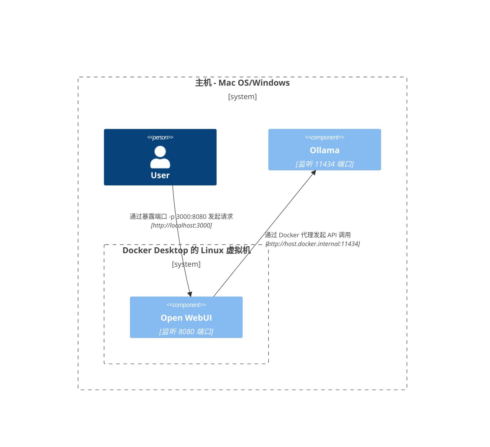
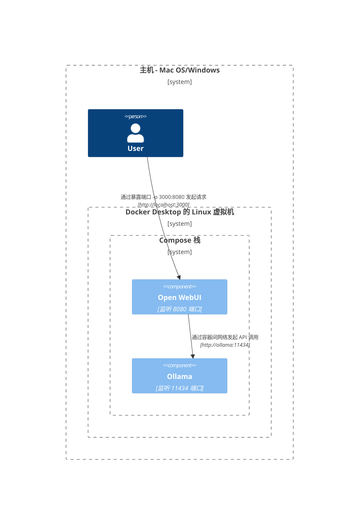
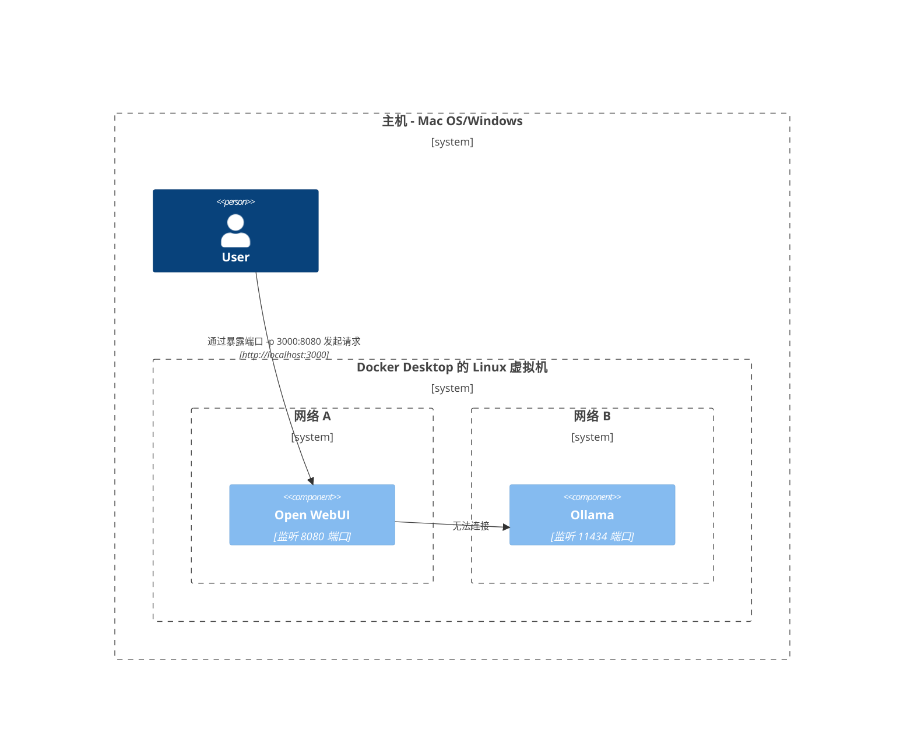
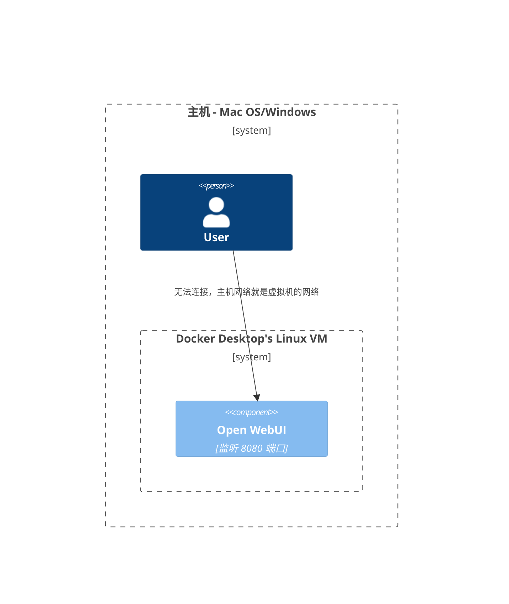
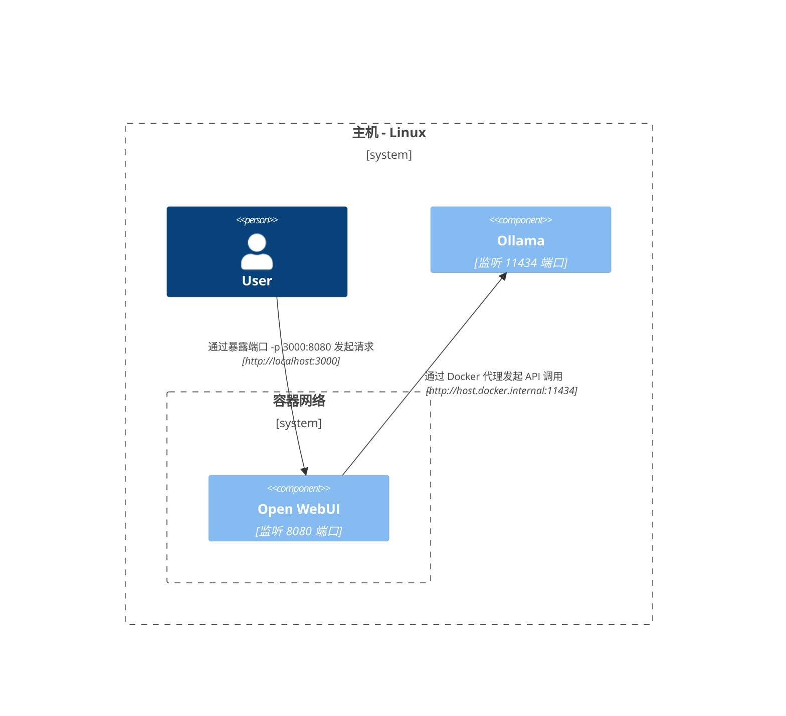
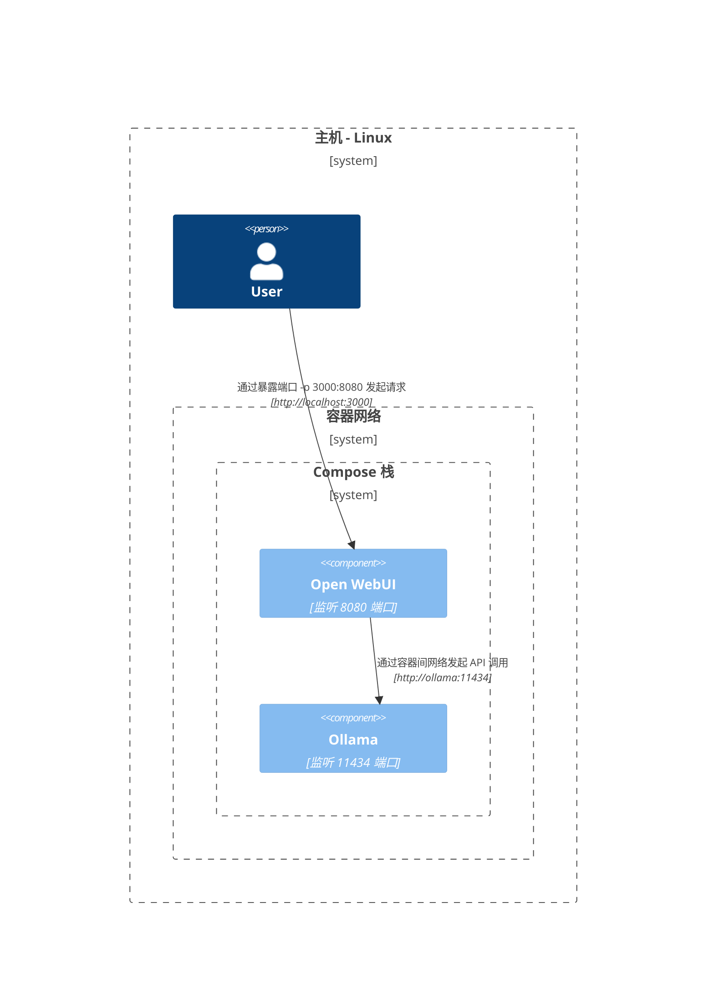
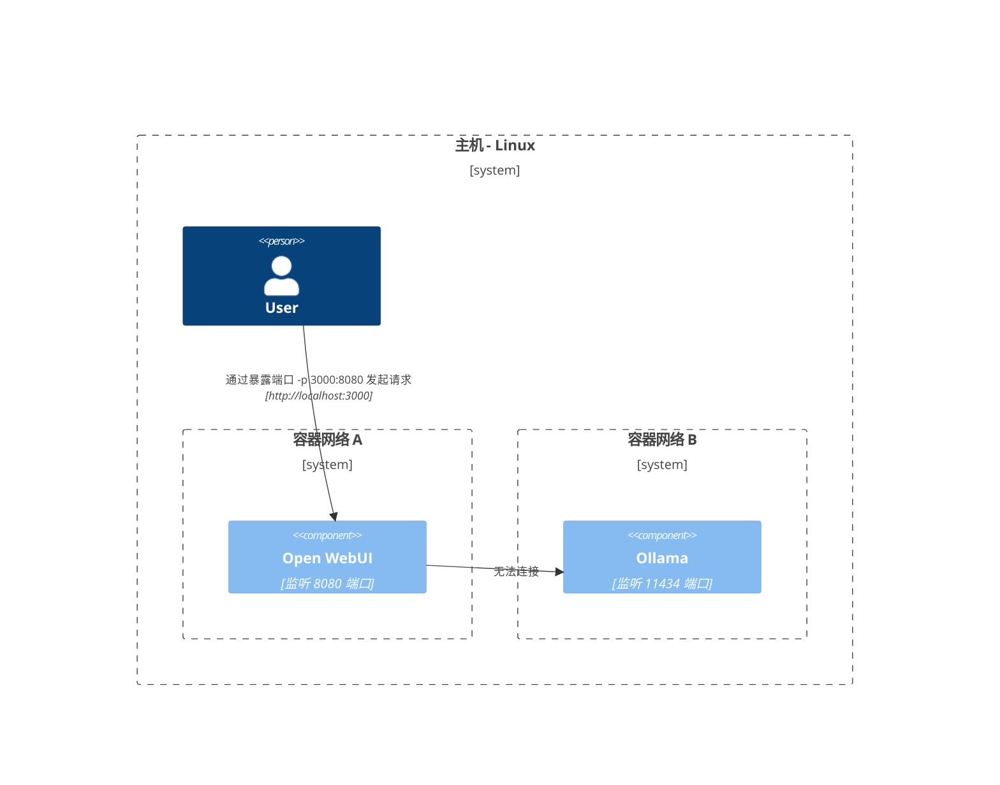
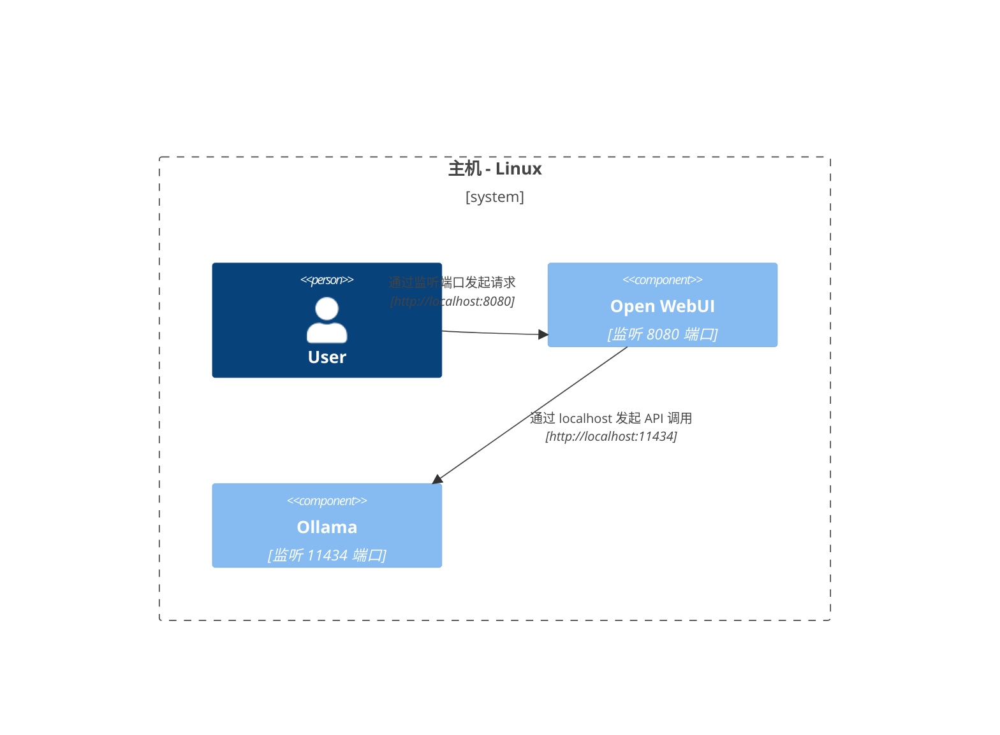

import Tabs from '@theme/Tabs';
import TabItem from '@theme/TabItem';

展示常见部署拓扑的可视化 C4 架构图，说明 Open WebUI、Ollama 和 Docker 的通信方式。用于调试连通性问题或规划架构。

<Tabs groupId="os-platform">
  <TabItem value="macos-windows" label="macOS / Windows" default>

  <Tabs groupId="macos-topology">
    <TabItem value="host-ollama-mac" label="主机 Ollama" default>

#### 主机运行 Ollama，容器运行 Open WebUI

`Ollama` 直接运行在主机上，`Open WebUI` 运行在 Docker 容器中。

    </TabItem>
    <TabItem value="compose-stack-mac" label="Compose 栈">

#### Ollama 和 Open WebUI 在 Compose 栈中

`Ollama` 和 `Open WebUI` 均配置在同一个 Docker Compose 栈中，简化网络通信。

    </TabItem>
    <TabItem value="separate-networks-mac" label="独立网络">

#### Ollama 和 Open WebUI 分属不同网络

`Ollama` 和 `Open WebUI` 部署在不同的 Docker 网络中，这会导致连通性问题。

    </TabItem>
    <TabItem value="host-network-mac" label="主机网络">

#### Open WebUI 使用主机网络

`Open WebUI` 使用主机网络，这在某些环境下会影响其连接能力。

    </TabItem>
  </Tabs>

  </TabItem>
  <TabItem value="linux" label="Linux">

  <Tabs groupId="linux-topology">
    <TabItem value="host-ollama-linux" label="主机 Ollama" default>

#### 主机运行 Ollama，容器运行 Open WebUI

`Ollama` 运行在主机上，`Open WebUI` 常署在 Docker 容器中。

    </TabItem>
    <TabItem value="compose-stack-linux" label="Compose 栈">

#### Ollama 和 Open WebUI 在 Compose 栈中

`Ollama` 和 `Open WebUI` 均位于同一个 Docker Compose 栈中，实现直接网络通信。

    </TabItem>
    <TabItem value="separate-networks-linux" label="独立网络">

#### Ollama 和 Open WebUI 在独立网络中

`Ollama` 和 `Open WebUI` 分属不同的 Docker 网络，可能导致连通性问题。

    </TabItem>
    <TabItem value="host-network-linux" label="主机网络">

#### Open WebUI 和 Ollama 均使用主机网络

`Open WebUI` 和 `Ollama` 都使用主机网络，实现无缝互联。

    </TabItem>
  </Tabs>

  </TabItem>
</Tabs>
